# Fixing GTA IV with 4 Mods

!!! warning
    This guide is only for The Complete Edition of Grand Theft Auto: IV. If you're playing on an older version, this guide won't work.

    This guide is only for Windows! If you're playing on Linux/Steam Deck, I have a seperate guide for that which you can [find here](#fusion-fix).

## Introduction

Grand Theft Auto IV’s PC port is already over 15 years old, and for most of that time, this version of the game has admittedly been a disaster.

Missing and broken graphical effects, poor performance and a confusing number of versions, all with their own individual pros and cons, often make playing GTA IV on PC seem like more hassle than it’s worth.

Thankfully, that is no longer the case. In the last few years, significant progress has been made by the modding community to fix GTA IV on PC. Modding has been made easier than ever, downgrading isn’t really necessary anymore and you can have the best version of GTA IV on any platform, by simply installing 4 excellent mods, and all it takes is a few minutes, so let’s get to it!

This guide is also available in video form if you'd prefer to follow that instead.

<iframe width="560" height="315" src="https://www.youtube.com/embed/UuXVYUGJ45Y?si=rjXTL8JH_IJwEvGh" title="YouTube video player" frameborder="0" allow="accelerometer; autoplay; clipboard-write; encrypted-media; gyroscope; picture-in-picture; web-share" referrerpolicy="strict-origin-when-cross-origin" allowfullscreen></iframe>

## Fusion Fix

So the first mod we'll install is Fusion Fix.

If you don't know, Fusion Fix is basically *the* mod which fixes most of GTA IV's issues. The game is broken in so many ways on PC compared to the console versions that it's actually hard to believe.

But Fusion Fix does more than just fixing problems, it also adds a few beautiful faithful graphical effects as well as a TON of quality-of-life features which brings the game up to a more modern standard and improves the overall experience.

I won't cover all of things Fusion Fix does in this guide, but I will go over some of the highlights of the mod so you'll know what you're in for.

If you just want to skip to installing the mod, you can [click here](#download-installation), otherwise keep scrolling.

### Highlights

#### Rain

Rain on PC was made almost invisible, rain streaks became shorter at higher frame rates and rain droplets on screen became pitch black and lost their refraction effect from console.

Fusion Fix makes rain much more visible, fixes rain streaks so they stay the same size regardless of frame rate and it makes rain droplets coloured again, as well as restoring the refraction effect.

  <!-- Bottom image -->
  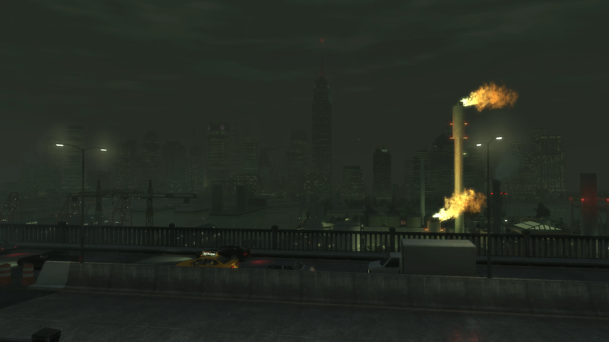
  
  <!-- Top image -->
  

    
  

  
  <!-- Vertical line -->
  

  <!-- Circular handle -->
  

  <!-- Captions -->
  
Before

  
After

  <!-- Bottom image -->
  
  
  <!-- Top image -->
  

    
  

  
  <!-- Vertical line -->
  

  <!-- Circular handle -->
  

  <!-- Captions -->
  
Before

  
After

  <!-- Bottom image -->
  
  
  <!-- Top image -->
  

    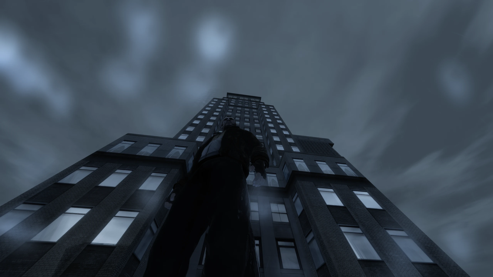
  

  
  <!-- Vertical line -->
  

  <!-- Circular handle -->
  

  <!-- Captions -->
  
Before

  
After

#### Reflections

Reflections were toned down significantly on PC, vehicle reflections became jagged due to a bug and mirror reflections became distorted at certain camera angles.

Fusion Fix restores the stronger console reflections, fixes the bug which made vehicle reflections jagged, and it fixes mirrors so they no longer become distorted at certain camera angles.

  <!-- Bottom image -->
  
  
  <!-- Top image -->
  

    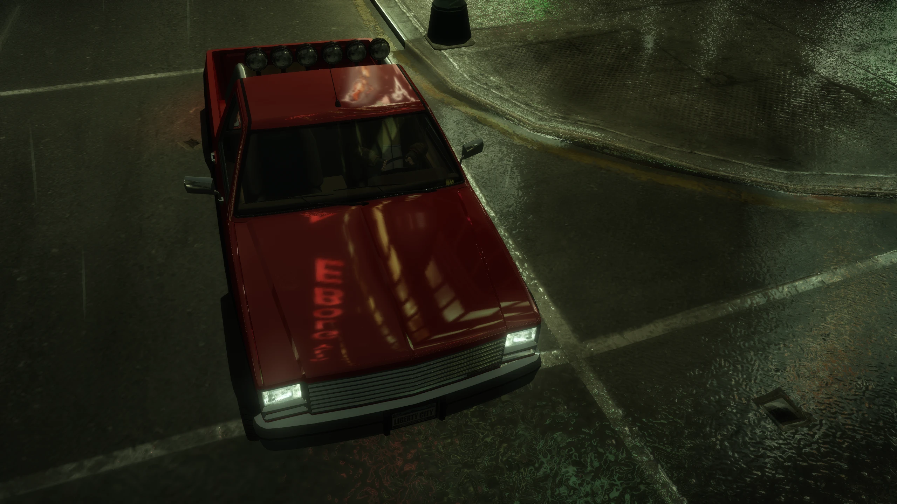
  

  
  <!-- Vertical line -->
  

  <!-- Circular handle -->
  

  <!-- Captions -->
  
Before

  
After

  <!-- Bottom image -->
  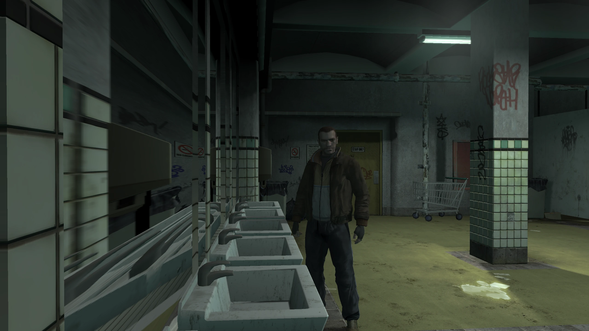
  
  <!-- Top image -->
  

    
  

  
  <!-- Vertical line -->
  

  <!-- Circular handle -->
  

  <!-- Captions -->
  
Before

  
After

#### Shadows

Shadows were by far the most broken aspect of the game

After patch 1.0.6.0, they had horrible filtering, suffered from peter panning, had their draw distance reduced, performed significantly worse than the original shadows implementation and had many other issues.

Fusion Fix completely replaces the filtering and bias code, adds support for animated tree shadows, adds contact hardening shadows and it also fixes dozens of other bugs related to shadows in general.

  <!-- Bottom image -->
  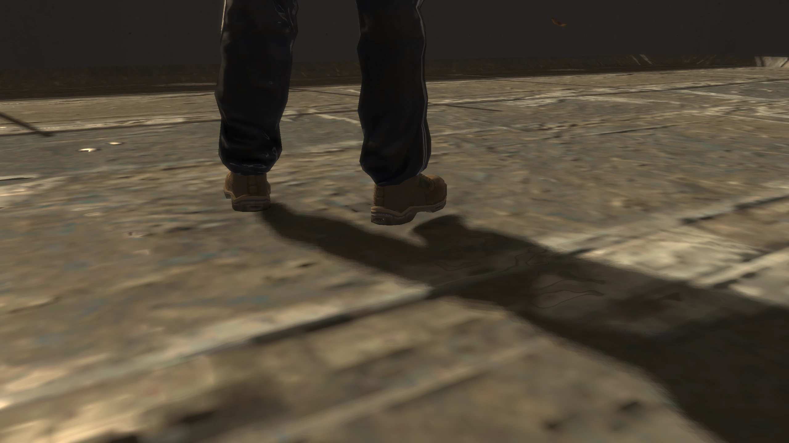
  
  <!-- Top image -->
  

    
  

  
  <!-- Vertical line -->
  

  <!-- Circular handle -->
  

  <!-- Captions -->
  
Before

  
After

  <!-- Bottom image -->
  
  
  <!-- Top image -->
  

    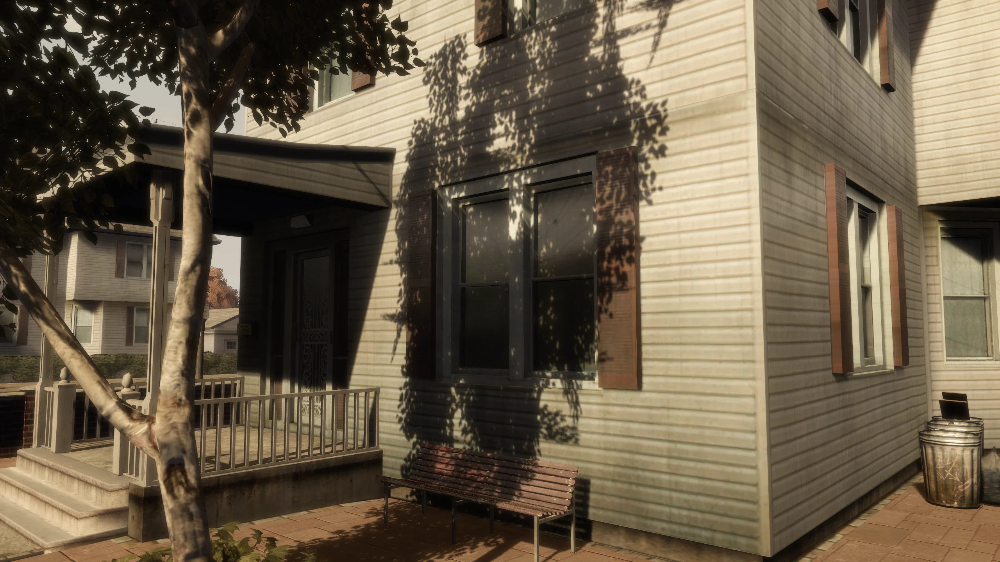
  

  
  <!-- Vertical line -->
  

  <!-- Circular handle -->
  

  <!-- Captions -->
  
Before

  
After

  <!-- Bottom image -->
  
  
  <!-- Top image -->
  

    
  

  
  <!-- Vertical line -->
  

  <!-- Circular handle -->
  

  <!-- Captions -->
  
Fusion Fix's Sharp Shadows

  
Fusion Fix's CHSS Shadows

#### Z-Fighting

The PC port of Grand Theft Auto IV was plagued with z-fighting not seen on other platforms.

Fusion Fix fixes this so z-fighting is basically nonexistent.

<video width="2560" controls>
  <source src="assets/fusionfix/zfight.mp4" type="video/mp4">
</video>

#### Object Fading

The 1.0.6.0 update for PC broke several graphical effects, one of them being screen door transparency in many materials, which led to the loss of LOD fade/blending. Terrain fading was also missing on ALL PC versions.

Fusion Fix restores this functionality from previous versions so fading now works again, and it also restores terrain fading from the console versions of the game.

<video width="2560" controls>
  <source src="assets/fusionfix/screendoorfade.mp4" type="video/mp4">
</video>

<video width="2560" controls>
  <source src="assets/fusionfix/terrainfade.mp4" type="video/mp4">
</video>

#### Definition

GTA IV's PC port has an odd "Definition" option which **ENABLES** graphical effects when OFF, and **DISABLES** them when ON. One effect is a blur filter which hides this pixel pattern effect as objects fade, but the blur is WAY stronger on PC due to leftover anti-aliasing code. This basically blurs the entire image.

  <!-- Bottom image -->
  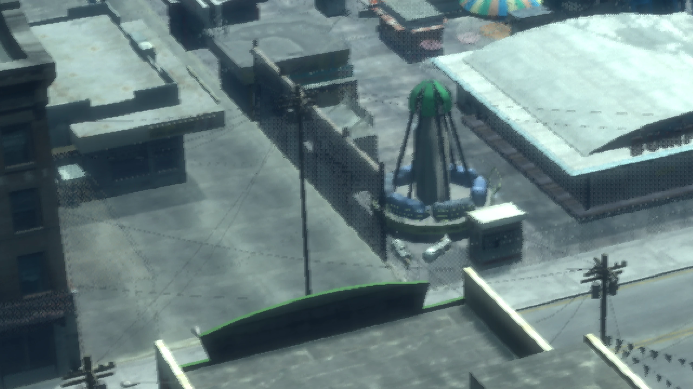
  
  <!-- Top image -->
  

    
  

  
  <!-- Vertical line -->
  

  <!-- Circular handle -->
  

  <!-- Captions -->
  
Vanilla Definition Off

  
Vanilla Definition On

  <!-- Bottom image -->
  
  
  <!-- Top image -->
  

    
  

  
  <!-- Vertical line -->
  

  <!-- Circular handle -->
  

  <!-- Captions -->
  
Vanilla Definition Off

  
Vanilla Definition On

Fusion Fix removes this broken anti-aliasing code and makes it so the blur filter only applies to objects as the pixel pattern effect occurs when "Definition" is on, rather than applying to the entire screen when it's off, this means Fusion Fix provides a sharper and cleaner image than seen on any other platform.

  <!-- Bottom image -->
  
  
  <!-- Top image -->
  

    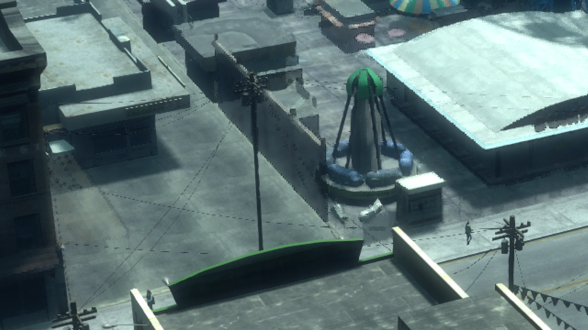
  

  
  <!-- Vertical line -->
  

  <!-- Circular handle -->
  

  <!-- Captions -->
  
Vanilla Definition On

  
Fusion Fix Definition On

  <!-- Bottom image -->
  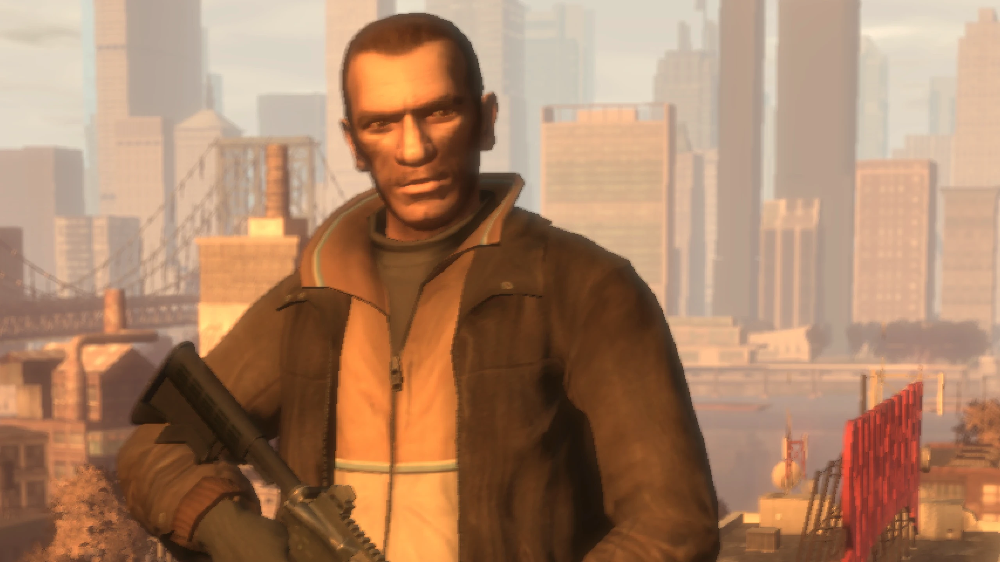
  
  <!-- Top image -->
  

    
  

  
  <!-- Vertical line -->
  

  <!-- Circular handle -->
  

  <!-- Captions -->
  
Vanilla Definition Off

  
Fusion Fix Definition On

#### Depth-of-Field

GTA IV's depth of field effect doesn't scale correctly with resolution and it only looks correct at 720p like on consoles. Depth of field is also tied to the games "Definition" option.

Fusion Fix fixes the scaling by implementing an efficient bokeh blur rated up to 4K, and added an individual depth of field option separate from the "Definition" option. This allows you to not only toggle depth of field, but also control how strong it is during gameplay.

  <!-- Bottom image -->
  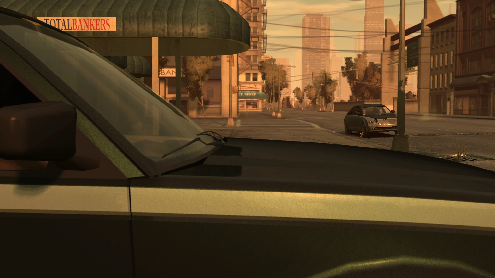
  
  <!-- Top image -->
  

    
  

  
  <!-- Vertical line -->
  

  <!-- Circular handle -->
  

  <!-- Captions -->
  
Before

  
After

  <!-- Bottom image -->
  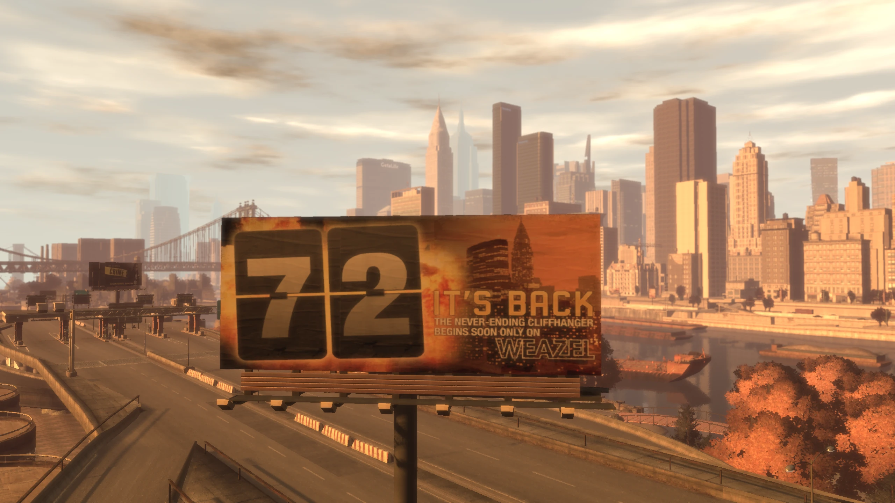
  
  <!-- Top image -->
  

    
  

  
  <!-- Vertical line -->
  

  <!-- Circular handle -->
  

  <!-- Captions -->
  
Before

  
After

#### Anti-Aliasing

The Xbox 360 version of GTA IV ran at 1280x720 with 2x MSAA. Meanwhile the PC version lacked any anti-aliasing whatsoever.

Fusion Fix implements FXAA and SMAA, which are simple and performance friendly, and do an excellent job at smoothing out jagged edges, especially at high resolutions.

  <!-- Bottom image -->
  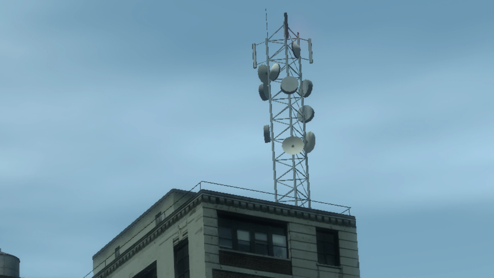
  
  <!-- Top image -->
  

    
  

  
  <!-- Vertical line -->
  

  <!-- Circular handle -->
  

  <!-- Captions -->
  
SMAA Off

  
SMAA On

#### Volumetric Fog

Fusion Fix adds a very nice volumetric fog shader to replace the games aging fog shader. This allows the draw distance to be massively increased, it hides the edge of the game world and fog no longer moves with the camera like it did in the vanilla game.

  <!-- Bottom image -->
  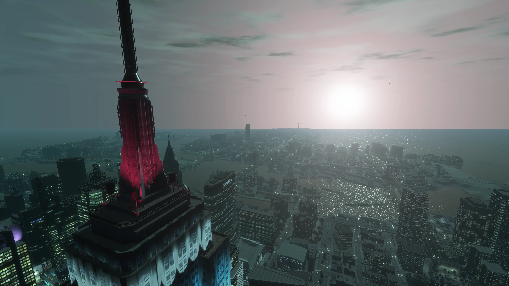
  
  <!-- Top image -->
  

    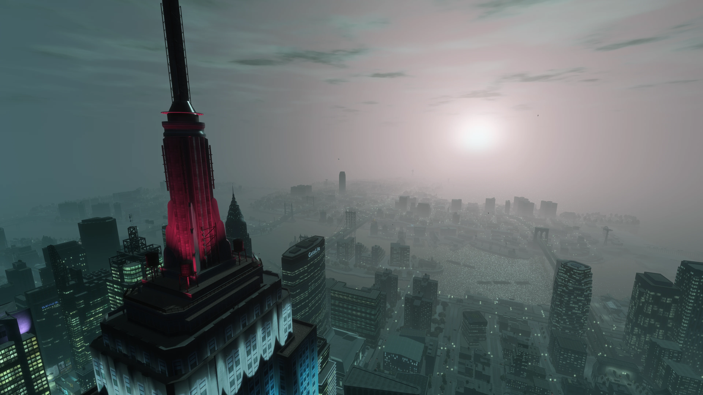
  

  
  <!-- Vertical line -->
  

  <!-- Circular handle -->
  

  <!-- Captions -->
  
Volumetric Fog Disabled

  
Volumetric Fog Enabled

  <!-- Bottom image -->
  
  
  <!-- Top image -->
  

    
  

  
  <!-- Vertical line -->
  

  <!-- Circular handle -->
  

  <!-- Captions -->
  
Volumetric Fog Disabled

  
Volumetric Fog Enabled

#### Sun Shafts

The sun in GTA IV is pretty effectless in comparison to every other 3D GTA game. So Fusion Fix adds an option for sun shafts/godrays, a nice effect that simulates light rays coming from the sun.

  <!-- Bottom image -->
  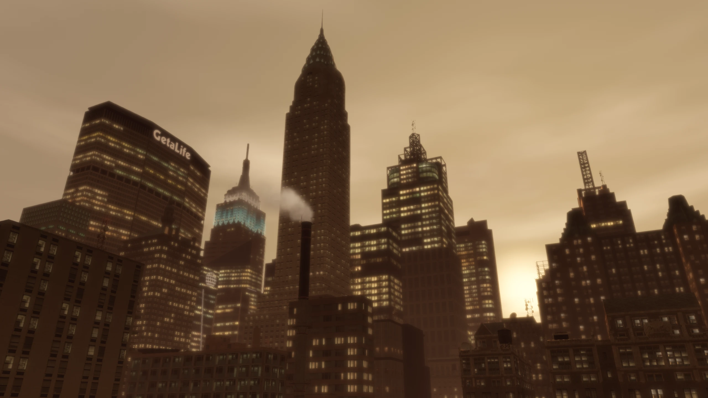
  
  <!-- Top image -->
  

    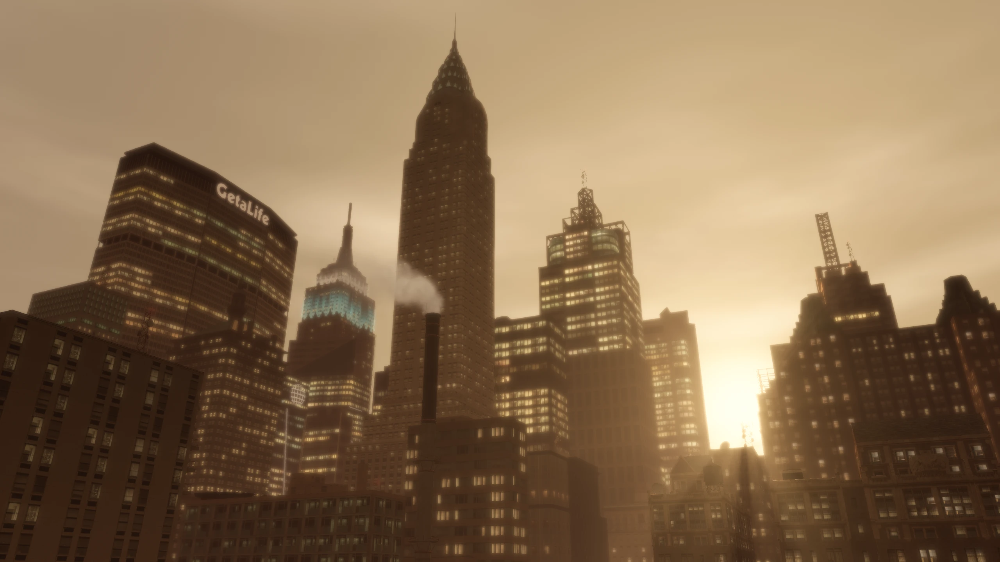
  

  
  <!-- Vertical line -->
  

  <!-- Circular handle -->
  

  <!-- Captions -->
  
Sun Shafts Disabled

  
Sun Shafts Enabled

  <!-- Bottom image -->
  
  
  <!-- Top image -->
  

    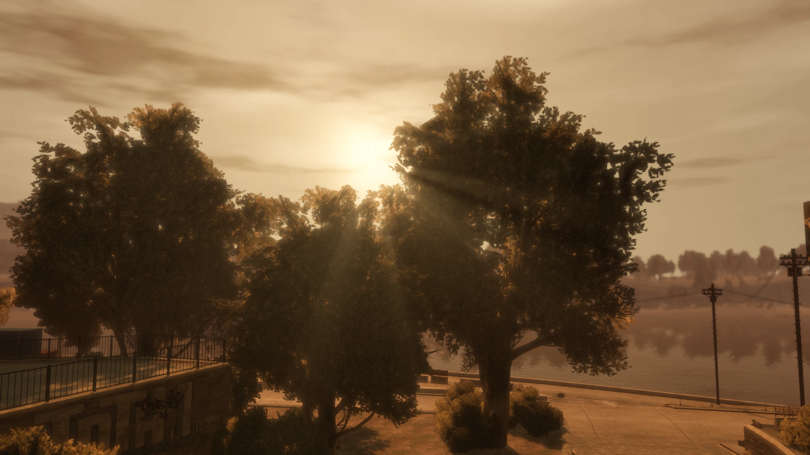
  

  
  <!-- Vertical line -->
  

  <!-- Circular handle -->
  

  <!-- Captions -->
  
Sun Shafts Disabled

  
Sun Shafts Enabled

#### Improved Loading Times

GTA IV on PC has an unskippable intro and it takes you to a main menu first instead of just loading your last save immediately like console.

Fusion Fix adds a skip intro and skip menu option in the GAME menu, as well as improving overall load times. This significantly reduces how long it takes to get in-game.

<video width="2560" controls>
  <source src="assets/fusionfix/improvedloadtimes.mp4" type="video/mp4">
</video>

#### Seasonal Events

Fusion Fix adds seasonal events to the game which includes snow at winter and a scarier atmosphere at Halloween. The snow effect is done almost entirely using shaders instead of replacing map textures, similar to GTA Online's yearly snow event. You can toggle this feature in the GAME menu.

#### Fusion Overloader

Fusion Fix adds a type of Modloader called Fusion OverLoader, you don’t really need to know too much about it for this guide. But if you do plan on installing more mods in the future, I’d recommend checking out my Fusion Overloader tutorial once you're done with this guide.

We'll be installing all our mods through Fusion Overloader in this guide, so you'll see how easy it is soon.

#### Even more...

If you want to know what else Fusion Fix fixes or adds to the game, you can either check out the full changelog on the [Fusion Fix GitHub](https://github.com/ThirteenAG/GTAIV.EFLC.FusionFix) or you can watch my video covering nearly the entirety of the mod.

<iframe width="560" height="315" src="https://www.youtube.com/embed/XTuOortPoY4?si=_mi7HnZJ6rsnRFnS" title="YouTube video player" frameborder="0" allow="accelerometer; autoplay; clipboard-write; encrypted-media; gyroscope; picture-in-picture; web-share" referrerpolicy="strict-origin-when-cross-origin" allowfullscreen></iframe>

### Download & Installation

Fusion Fix has two very simple and easy installation methods. You can install the mod manually OR you can use the Fusion Fix installer. I'd recommend manual, but pick whichever you prefer. Once you follow the steps, Fusion Fix will be installed.

#### Manual Installation

1. Download the latest Fusion Fix .zip from the [official GitHub release page](https://github.com/ThirteenAG/GTAIV.EFLC.FusionFix/releases) (found under **"Assets"**).
2. Open the archive you just downloaded and then copy and paste everything from the archive into your game folder where **"GTAIV.exe"** is located.

!!! tip
    If you're not sure how to find your game folder...

      - **Steam**: You can find it by right clicking on **"Grand Theft Auto IV: The Complete Edition"** in your Steam library, going to **"Manage"** and then clicking **"Browse Local Files"**. The **"GTAIV"** folder is where **"GTAIV.exe"** is located.

      - **Rockstar Games Launcher**: You can find it by clicking on **"Settings"** in the Rockstar Games Launcher, click **"Grand Theft Auto IV: The Complete Edition"** in your installed games list, find **"View installation folder"** and then click **"Open"** next to it. The **"GTAIV"** folder is where **"GTAIV.exe"** is located.
 

#### Installer Installation

1. Download the latest Fusion Fix installer from the [official GitHub release page](https://github.com/ThirteenAG/GTAIV.EFLC.FusionFix/releases) (found under **"Assets"**. Web installer will download the mod files when using the installer, offline installer downloads the mod files alongside the installer).
2. Launch the installer, it should automatically detect the location of your Grand Theft Auto: IV folder and then click install.

## Console Visuals

Our next mod to install is Console Visuals.

The PC version of GTA IV changed quite a few of the games assets, so they're different than console. Things like certain clothing options, animations and other things were different between the two versions.

The mod Console Visuals aims to restore all of that content from console. Most of the changes are completely subjective, they’re just small things such as...

The way Niko might hold a specific weapon...

  <!-- Bottom image -->
  
  
  <!-- Top image -->
  

    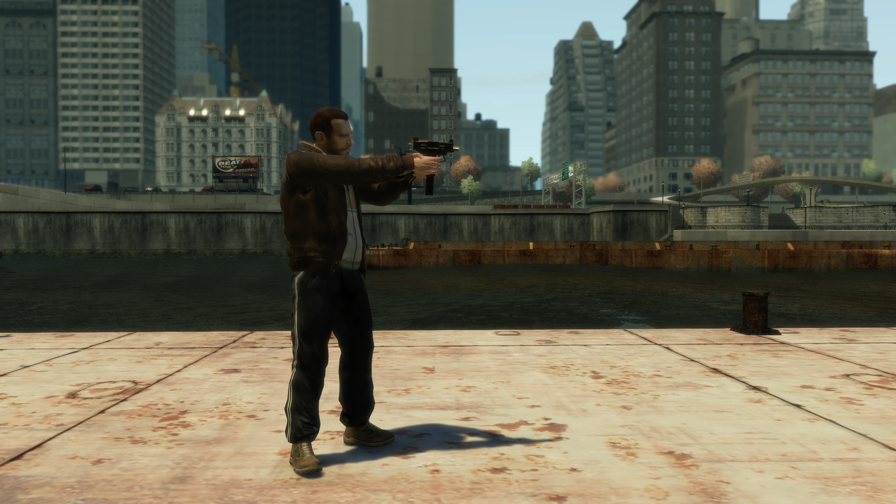
  

  
  <!-- Vertical line -->
  

  <!-- Circular handle -->
  

  <!-- Captions -->
  
PC Uzi Animation

  
Console Uzi Animation

Or the size of the games help boxes...

  <!-- Bottom image -->
  
  
  <!-- Top image -->
  

    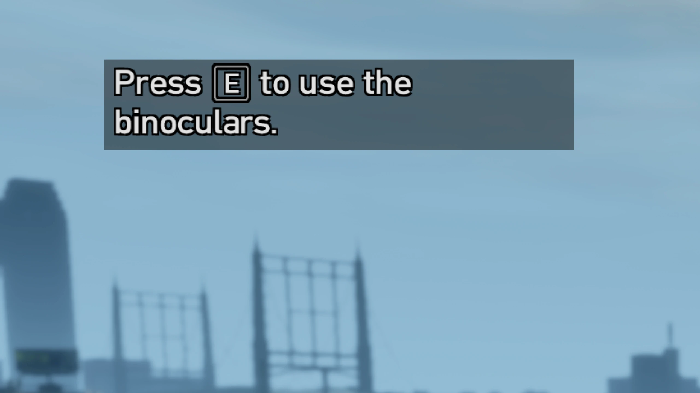
  

  
  <!-- Vertical line -->
  

  <!-- Circular handle -->
  

  <!-- Captions -->
  
PC Help Box

  
Console Help Box

But Console Visuals does come with one change which is definitely an improvement over the PC version, and that’s the vegetation.

On PC, a lot of the vegetation was changed, this includes a new grass model, which is actually worse because it's offset too low which causes the bottom half of the grass to be pushed under the ground.

Just look at this comparison here, the grass on PC is mostly under the ground compared to the console grass.

  <!-- Bottom image -->
  
  
  <!-- Top image -->
  

    
  

  
  <!-- Vertical line -->
  

  <!-- Circular handle -->
  

  <!-- Captions -->
  
PC Grass

  
Console Grass

As well as restoring the console grass, it also restores the console trees. However, the trees in Console Visuals have higher resolution textures compared to console, because as it turns out, Rockstar reused these tree textures in Max Payne 3 at a higher resolution.

The team behind Console Visuals managed to extract those textures and got them into GTA IV with some corrections made to them.

  <!-- Bottom image -->
  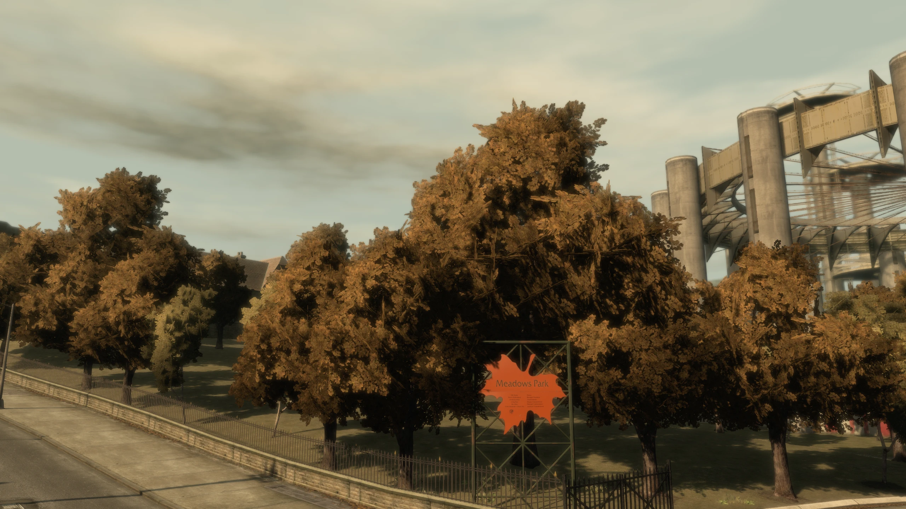
  
  <!-- Top image -->
  

    
  

  
  <!-- Vertical line -->
  

  <!-- Circular handle -->
  

  <!-- Captions -->
  
PC Trees

  
Console Trees

  <!-- Bottom image -->
  
  
  <!-- Top image -->
  

    
  

  
  <!-- Vertical line -->
  

  <!-- Circular handle -->
  

  <!-- Captions -->
  
PC Trees

  
Console Trees

  <!-- Bottom image -->
  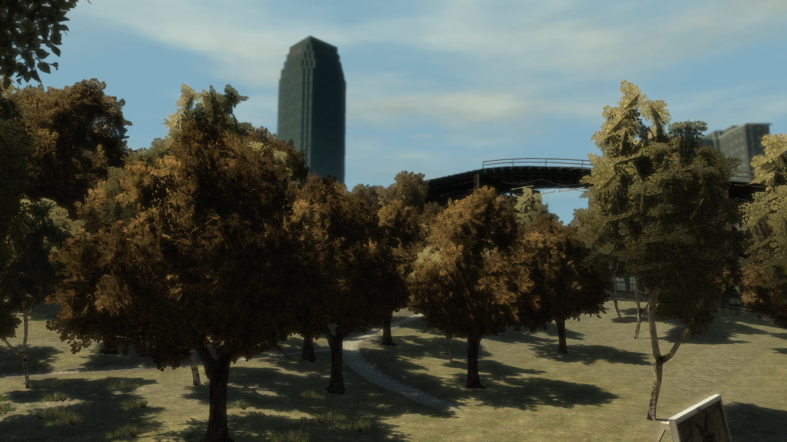
  
  <!-- Top image -->
  

    
  

  
  <!-- Vertical line -->
  

  <!-- Circular handle -->
  

  <!-- Captions -->
  
PC Trees

  
Console Trees

### Download & Installation

For this guide we'll just install the vegetation improvements from Console Visuals, as it's the one thing that I'd argue isn't really subjective compared to the other changes between console and PC.

If you want to install the other console assets from Console Visuals, have a look at my [Console Visuals Guide](#console-visuals) so you can pick and choose what you prefer. But like I said, console vegetation is arguably better in every aspect, so we'll just install that for this guide. 

1. Download the latest **"Console.Vegetation.zip"** from the [official Console Visuals GitHub release page](https://github.com/Tomasak/Console-Visuals/releases) (found under **"Assets"**).
2. Open the vegetation archive you just downloaded and then copy and paste the **"update"** folder from the archive, into your **"GTAIV"** folder, where **"GTAIV.exe"** is located.

!!! tip
    If you're not sure how to find your game folder...

      - **Steam**: You can find it by right clicking on **"Grand Theft Auto IV: The Complete Edition"** in your Steam library, going to **"Manage"** and then clicking **"Browse Local Files"**. The **"GTAIV"** folder is where **"GTAIV.exe"** is located.

      - **Rockstar Games Launcher**: You can find it by clicking on **"Settings"** in the Rockstar Games Launcher, click **"Grand Theft Auto IV: The Complete Edition"** in your installed games list, find **"View installation folder"** and then click **"Open"** next to it. The **"GTAIV"** folder is where **"GTAIV.exe"** is located.

And that’s it, the vegetation from Console Visuals is installed! Like I said, if you do want to install the rest of Console Visuals, check out my full [Console Visuals Guide](#console-visuals) so you can pick and choose what you prefer.

## Various Fixes

The penultimate mod we’re going to install is Various Fixes. This mod fixes a huge number of texture issues, prop placement issues and other problems and inconsistencies throughout GTA IV's assets.

It’s hard to even cover everything this mod fixes as the [list of fixes](https://gtaforums.com/topic/975211-various-fixes/) is VERY big. However, I'll give you three quick examples so you can get an idea of what this mod is about.

  <!-- Bottom image -->
  
  
  <!-- Top image -->
  

    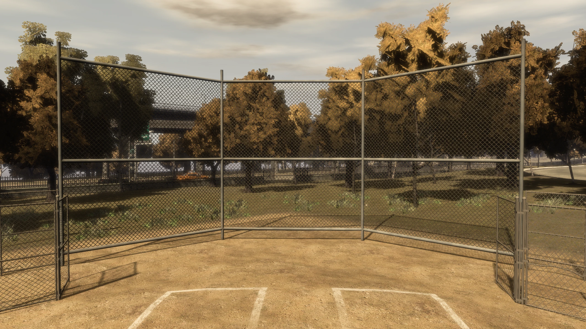
  

  
  <!-- Vertical line -->
  

  <!-- Circular handle -->
  

  <!-- Captions -->
  
Vanilla

  
Various Fixes

  <!-- Bottom image -->
  
  
  <!-- Top image -->
  

    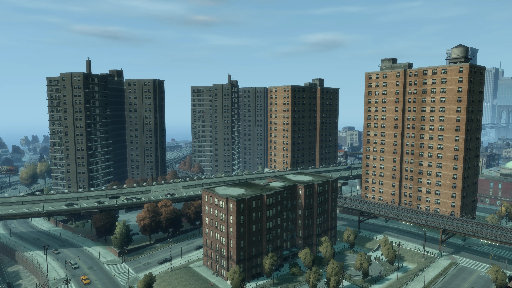
  

  
  <!-- Vertical line -->
  

  <!-- Circular handle -->
  

  <!-- Captions -->
  
Vanilla

  
Various Fixes

  <!-- Bottom image -->
  
  
  <!-- Top image -->
  

    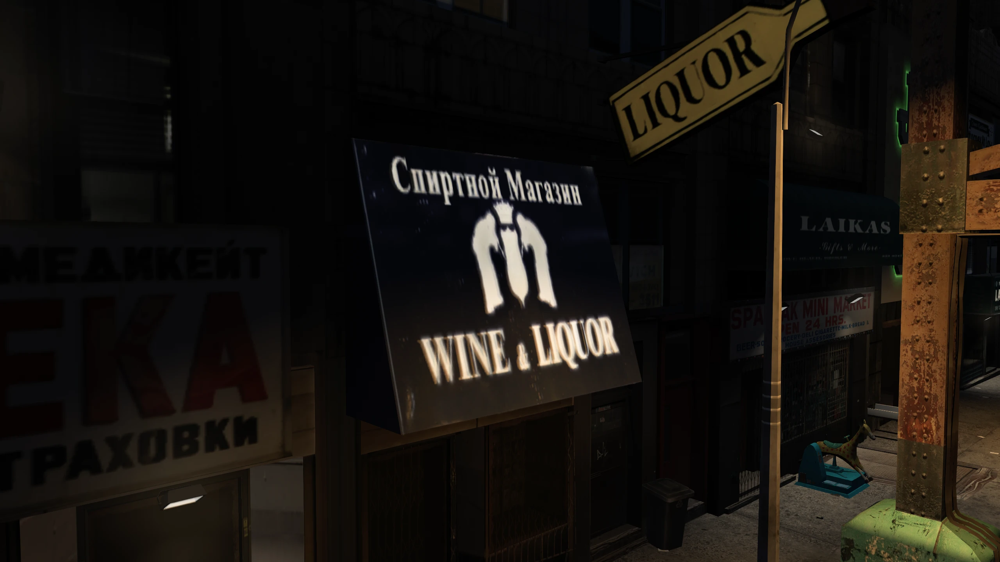
  

  
  <!-- Vertical line -->
  

  <!-- Circular handle -->
  

  <!-- Captions -->
  
Vanilla

  
Various Fixes

### Download and Installation

Okay let's download and install Various Fixes.

1. Download the latest **"Installation.through.Fusion.Overloader.zip"** from the [official Various Fixes GitHub release page](https://github.com/valentyn-l/GTAIV.EFLC.Various.Fixes/releases) (found under **"Assets"**).
2. Open the archive you just downloaded, open the **"Installation through Fusion Overloader"** folder in the archive and then copy and paste the **"update"** folder from that folder, into your **"GTAIV"** folder, where **"GTAIV.exe"** is located.

!!! tip
    If you're not sure how to find your game folder...

      - **Steam**: You can find it by right clicking on **"Grand Theft Auto IV: The Complete Edition"** in your Steam library, going to **"Manage"** and then clicking **"Browse Local Files"**. The **"GTAIV"** folder is where **"GTAIV.exe"** is located.

      - **Rockstar Games Launcher**: You can find it by clicking on **"Settings"** in the Rockstar Games Launcher, click **"Grand Theft Auto IV: The Complete Edition"** in your installed games list, find **"View installation folder"** and then click **"Open"** next to it. The **"GTAIV"** folder is where **"GTAIV.exe"** is located.

## Radio Restoration

Like all of the other old GTA titles, GTA IV has had music removed due to licenses expiring.

The radio station Vladivostok, lost all of its original songs except one when licensing expired in 2018, so Rockstar added a whole new soundtrack to the station instead, other radio stations also lost some songs too.

The best mod to restore cut music from the Complete Edition of GTA IV, is the Radio Restoration mod, so we're going to use that in this guide.

### Download and Installation

1. Download the latest **"Radio.Restoration.Mod.zip"** from the [official Radio Restoration GitHub release page](https://github.com/Tomasak/GTA-Downgraders/releases) (found under **"Assets"**).
2. Open the archive you just downloaded and then copy "IVCERadioRestoration.exe" anywhere you'd like.
3. Run the tool and follow the steps given. There's some additional customisation that is explained in the installer.

You've now restored the music cut from GTA IV!

## Outro and Additional Links

And that's it! You now have the BEST version of GTA IV on ANY platform.

Some of the stuff I covered throughout this guide you might want to follow up on.

If you'd like to learn more about Fusion Overloader, the modloader that comes with Fusion Fix, check out my Fusion Overloader guide.

If you'd like to install the other components of Console Visuals, check out my Console Visuals guide which will show you what each component does and how to install them.

-----

  <h3>Did this help?</h3>
  
If you found this guide helpful, please consider supporting me and my work on Patreon, it's very much appreciated! ❤️

  <a
    class="md-button"
    href="https://patreon.com/tjgm"
    target="_blank"
    rel="noopener"
    style="background:#F96854; color:white; border:none; border-radius:8px; padding:.6em 1.2em; margin-top:0.5rem;"
  >
    ⭐ Support on Patreon
  </a>

