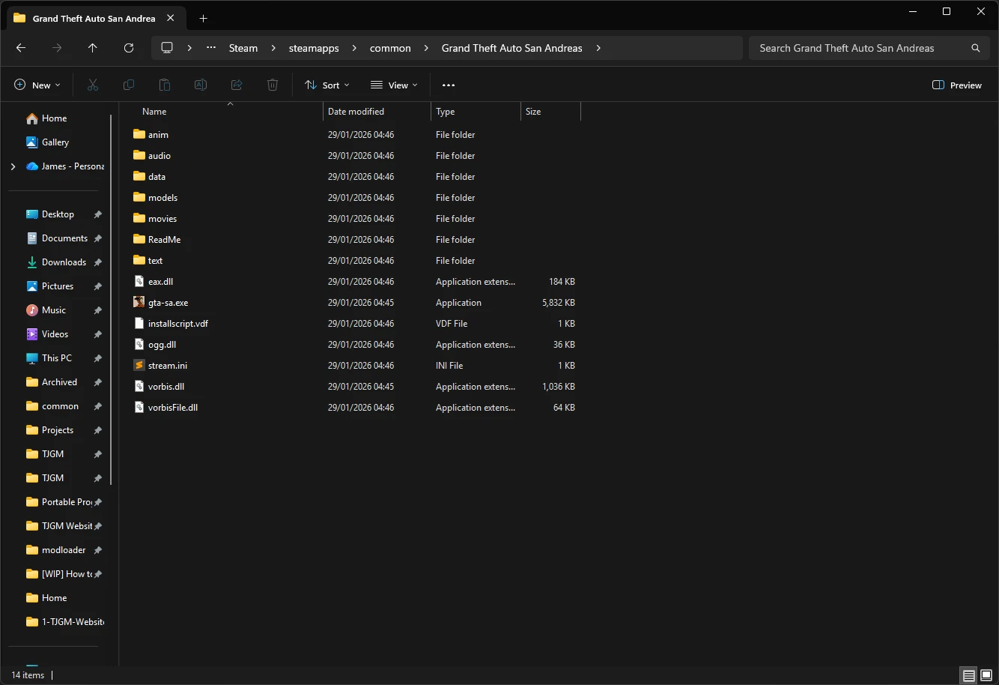
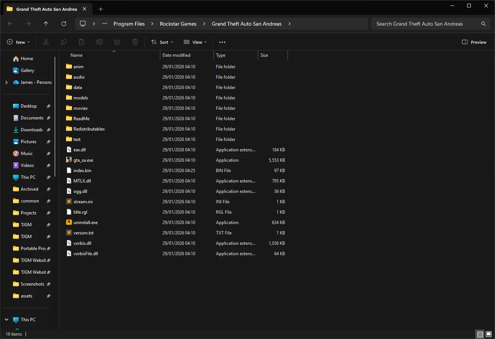
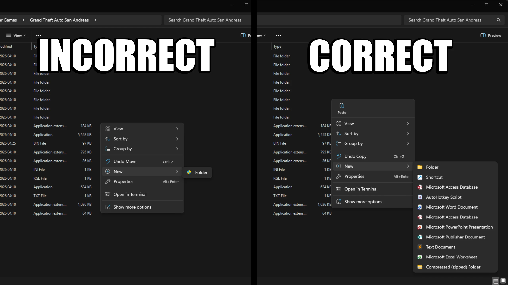
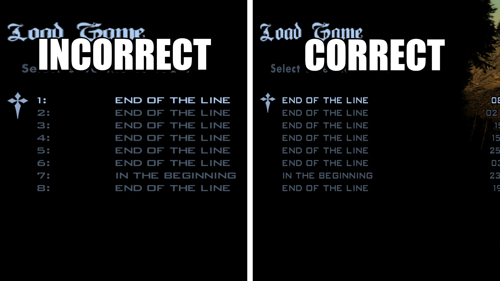

# How to Downgrade EVERY Version of GTA San Andreas

## Introduction

!!! info

    This guide **IS NOT** for *Grand Theft Auto: San Andreas - The Definitive Edition* which released in 2021. This guide is **ONLY** for the original *Grand Theft Auto: San Andreas* released in 2004.
    
    The only reason you should downgrade GTA San Andreas is if you want to mod the game. If you're not going to mod, you should stick with the latest version of San Andreas as it has some vital fixes that make the game playable.

Depending on the copy of San Andreas you have, downgrading may be different, so this guide will be split into different sections for the Steam, Rockstar Games Launcher and DVD copies of the game. Press one of the buttons below to be taken to the section of the guide for whichever copy you have.

This guide is also available in video form on the TJGM YouTube channel.

<iframe width="560" height="315" src="https://www.youtube.com/embed/83z83I153oc?si=zNN8eRrpEmvly28I" title="YouTube video player" frameborder="0" allow="accelerometer; autoplay; clipboard-write; encrypted-media; gyroscope; picture-in-picture; web-share" referrerpolicy="strict-origin-when-cross-origin" allowfullscreen></iframe>

[ :material-steam: Steam ](#downgrading-the-steam-version-of-san-andreas){ .md-button .md-button--primary }  

[ :simple-rockstargames: Rockstar Games Launcher ](#downgrading-the-rockstar-games-launcher-version-of-san-andreas){ .md-button .md-button--primary }  

[ :material-disc: DVD ](#downgrading-the-dvd-version-of-san-andreas){ .md-button .md-button--primary }

## Downgrading the Steam Version of San Andreas

!!! warning

    Make sure you launch Grand Theft Auto: San Andreas at least once on Steam before downgrading. If you don't do a first time launch before downgrading, Steam will possibly update San Andreas and undo the downgrader!

- Step 1: Download the **TJGM San Andreas Downgrader** from either [Mega](https://mega.nz/file/xzBQkYgZ#bZDF3L9S2zE4Jj8DMH-lnNzQHmiXarlJERPaUT1-CNo) or [Mediafire](https://www.mediafire.com/file/pu3gsnjsl673l6l/TJGM_GTA_San_Andreas_Downgrader.zip/file).
- Step 2: Open your San Andreas folder. You can find this by right clicking **"Grand Theft Auto: San Andreas"** in your Steam library, go to **"Manage"** and then click **"Browse local files"** from the menu. You should see the San Andreas files like this.

    

- Step 3: Open the **TJGM San Andreas Downgrader** archive you downloaded and place all of the files from the archive, into the San Andreas folder. Replace all of the files when asked.

And that's it, the Steam version of San Andreas is now downgraded.

If you have any other questions, check out the [Questions & Answers](#questions-and-answers) section.

!!! tip

    If Rockstar for some reason ever updates the Steam version of San Andreas again, it will revert the downgrader and if you have mods installed, it will break your mods. It's *very* unlikely they'll update San Andreas now as it's no longer for sale on Steam, but there's still a *very small* possibility.

    So you have two options.
    
    - Option A: You take the *really* small risk and continue to launch San Andreas through Steam.

    - Option B: You rename your San Andreas folder to literally anything else so Steam will no longer detect it. The downside to this is, you won't be able to launch the game through Steam, but instead you can launch the game by clicking **"gta_sa.exe"**.

    It's up to you really. Neither will have any impact on your playing experience and this is mostly just a precaution.

    If you do rename your San Andreas folder, you can delete “gta-sa.exe”, and just launch San Andreas by clicking “gta_sa.exe” instead.

    There’s no difference between the two exe's other than Steam uses “gta-sa.exe” instead of “gta_sa.exe” to launch the game. Both executables are the exact same aside from their names.

    If you’re launching San Andreas through Steam, I’d recommend keeping both “gta-sa.exe” and “gta_sa.exe”.

    The reason for this is, some REALLY old mods may expect the games EXE to be called “gta_sa.exe”, so they won’t work if you launch the game through Steam, which uses “gta-sa.exe”.
    Again, these are really old mods that you’ll likely never even see. If for some reason a mod you want does need the games EXE to be called “gta_sa.exe”, you’ll just have to launch the game through that EXE instead of through Steam.

## Downgrading the Rockstar Games Launcher Version of San Andreas

!!! warning

    Rockstar Games Launcher restricts your ability to modify game files without administrator approval. This is a problem because some mods will need to change files as you play, and unless you run the game as an admin, which I really wouldn't recommend, mods won't work correctly.

    Along with that, Rockstar Games Launcher will also update your game anytime files are modified, undoing your changes. This will also reset permissions on the games folder even if you change it.

    The best solution to these issues is to simply copy your San Andreas folder, and paste it somewhere where administrator approval isn't required. This will be our first steps.

- Step 1: Open your San Andreas folder. You can find this by clicking on **"Settings"** in the Rockstar Games Launcher, click San Andreas in your installed games list, find **"View installation folder"** and then click **"Open"** next to it. You should see the San Andreas files like this.

    

- Step 2: Click on **"Rockstar Games"** in the address bar to go just outisde the San Andreas folder and then copy and paste your San Andreas folder to another location on your PC. I'd recommend copying the game to a generic games folder outside of Program Files, or on another drive.
    
    !!! warning
        Make sure you copy and paste the game, don't cut and paste it. Cutting and pasting the game will carry over the restrictive permissions from Rockstar Games Launcher, which you don't want.

- Step 3: Check if you can modify the pasted game folder without admin approval. You can check this by right clicking anywhere in your game folder, go to **"New"** in the context menu, and if the option to create a new folder hasn't got the little shield icon next to it, you're all set to go.

    

    If you still have the shield icon next to the new folder option, copy the game folder again and paste it somewhere else on your system that isn't as restrictive.

- Step 4: Download the **TJGM San Andreas Downgrader** from either [Mega](https://mega.nz/file/xzBQkYgZ#bZDF3L9S2zE4Jj8DMH-lnNzQHmiXarlJERPaUT1-CNo) or [Mediafire](https://www.mediafire.com/file/pu3gsnjsl673l6l/TJGM_GTA_San_Andreas_Downgrader.zip/file).
- Step 5: Open the **TJGM San Andreas Downgrader** archive you downloaded and place all of the files from the archive, into the San Andreas folder. Replace all of the files when asked.

And that's it, your Rockstar Games Launcher copy of San Andreas is now downgraded. You can launch San Andreas by clicking "gta_sa.exe".

If you have any other questions, check out the [Questions & Answers](#questions-and-answers) section.

!!! tip "Tips"
    - You can delete your original Rockstar Games Launcher copy of the game to save space on your PC.

    - You can delete **"gta-sa.exe"** as it's only used for launching the game on Steam.

## Downgrading the DVD Version of San Andreas

- Step 1: Install San Andreas from the DVD onto your PC. When installing, make sure **YOU DON'T** install the game in Program Files, I'd recommend installing it in a generic games folder outside of Program Files, or on another drive entirely. Remember *exactly* where you install San Andreas and when the game is installed, open the San Andreas folder.
- Step 2: Download the **TJGM San Andreas Downgrader** from either [Mega](https://mega.nz/file/xzBQkYgZ#bZDF3L9S2zE4Jj8DMH-lnNzQHmiXarlJERPaUT1-CNo) or [Mediafire](https://www.mediafire.com/file/pu3gsnjsl673l6l/TJGM_GTA_San_Andreas_Downgrader.zip/file).
- Step 3: Open the **TJGM San Andreas Downgrader** archive you downloaded and place all of the files from the archive, into the San Andreas folder. Replace all of the files when asked.

And that's it, your DVD copy of San Andreas is now downgraded. After downgrading, you don't need the DVD to launch the game anymore. You can launch San Andreas by clicking "gta_vc.exe".

If you have any other questions, check out the [Questions & Answers](#questions-and-answers) section.

!!! tip
    - You can delete **"gta-sa.exe"** as it's only used for launching the game on Steam.

## Questions and Answers

### How do I know if the downgrader worked?

You can tell if the downgrader worked by three easy ways.

1. When you start the game, if the downgrader worked you should see EAX and NVIDIA splash screens. These don't appear in later versions.

    

    

2. If you have a save game from previously playing, start the game, go to **"LOAD GAME"** and then check if your saves are numbered or not.

    If saves are numbered, the game isn't downgraded, if they aren't numbered, you've downgraded successfully.

    

3. If you haven't got a save, you can tell by checking whether 16:9 resolutions are available or not. On 1.0, 16:9 resolutions such as 1920x1080 are missing, on later versions this issue was fixed.

    Start the game, go to "OPTIONS", go to "DISPLAY SETUP" and then click "ADVANCED". Scroll on the "RESOLUTION" option to change it and check if 1280x720 or 1920x1080 is available. If they are, you either have mods installed which fix this issue or you haven't downgraded correctly. If you don't see these resolutions, it means you've downgraded successfully.

### Why is my mouse no longer working since I downgraded?

Like I warned in the beginning of this guide, San Andreas v1.0 has some very annoying bugs that make it difficult to play, including this mouse bug. If you're downgrading, you basically need to mod to make the game playable. If you aren't going to mod, you shouldn't have downgraded.

After downgrading, I'd recommend you follow my ULTIMATE MODDING GUIDE for GTA San Andreas. A fully in-depth, easy to follow modding guide which will teach you the best way to mod San Andreas.

<iframe width="560" height="315" src="https://www.youtube.com/embed/0hLCOjAf6zA?si=eia3QYAaEvo5wewN" title="YouTube video player" frameborder="0" allow="accelerometer; autoplay; clipboard-write; encrypted-media; gyroscope; picture-in-picture; web-share" referrerpolicy="strict-origin-when-cross-origin" allowfullscreen></iframe>

### What is the difference between your downgrader and others?

Unfortunately downgraders have been a bit of a mess in the GTA community, overcomplicating the downgrading process. So I've made mine as simple as possible.

Some downgraders come as actual installers, however these often have issues on certain systems or require admin permission to work. There's also downgraders that come with mods prepacked, however this is an issue as the mods can often be outdated OR users will get these mods from these overcomplicated downgraders, not realise what they have installed, then when they mod the game themselves, they reinstall the same mods, causing issues with their game.

Lastly, a lot of downgraders simply come with the wrong .exe, as there's several 1.0 exe's from different regions. My downgrader comes with the most mod compatible .exe.

### Why is this downgrader bigger than others?

Most downgraders compress their files using 7zip or WinRAR, which shrinks the archive size down when downloading. I chose to instead pack my downgrader in a basic Windows .zip archive. This is so users don't have to download third party tools on older versions of Windows to use my downgrader, as .zip archives can be opened directly in File Explorer on all Windows versions.

The downgrader IS safe. The .zip archive simply contains 1.0 game files that have been changed in later versions. The biggest files are the audio files.

-----

  <h3>Did this help?</h3>
  
If you found this guide helpful, please consider supporting me and my work on Patreon, it's very much appreciated! ❤️

  <a
    class="md-button"
    href="https://patreon.com/tjgm"
    target="_blank"
    rel="noopener"
    style="background:#F96854; color:white; border:none; border-radius:8px; padding:.6em 1.2em; margin-top:0.5rem;"
  >
    ⭐ Support on Patreon
  </a>

