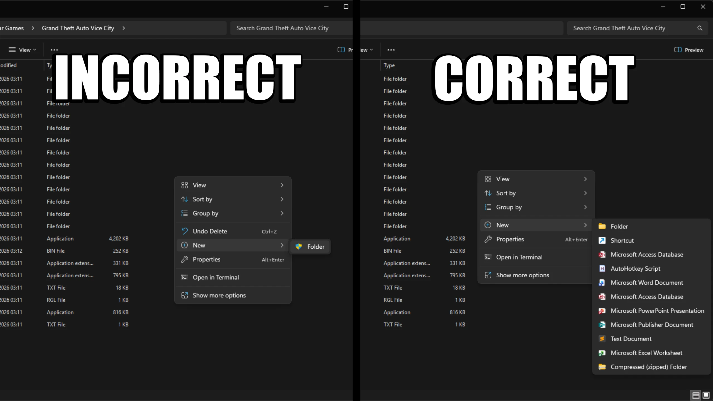

# Restoring Music Cut from GTA Vice City without Downgrading

## Introduction

!!! info

    This guide **IS NOT** for *Grand Theft Auto: Vice City - The Definitive Edition* which released in 2021. This guide is **ONLY** for the original *Grand Theft Auto: Vice City* released in 2002.
    
    This guide **IS NOT** for downgrading your game! This guide is simply for those who want to play Vice City with all of the original music, without needing to downgrade to an older version.
    
    If you do want to downgrade, which you only really need to do if you're modding Vice City, I have a [seperate guide](../How-to-Downgrade-EVERY-Version-of-GTA-Vice-City/index.md) for that. If you've already downgraded, you don't need to follow this guide as downgrading already restores the cut music.

    You only need to follow this guide if you have the Steam or Rockstar Games Launcher version of the game. The DVD versions have all of the original music.

Depending on the copy of Vice City you have, restoring the music may be different, so this guide will be split into different sections for the Steam and Rockstar Games Launcher copies of the game. Press one of the buttons below to be taken to the section of the guide for whichever copy you have.

[ :material-steam: Steam ](#restoring-music-cut-from-the-steam-version-of-vice-city){ .md-button .md-button--primary }  

[ :simple-rockstargames: Rockstar Games Launcher ](#restoring-music-cut-from-the-rockstar-games-launcher-version-of-vice-city){ .md-button .md-button--primary }  

## Restoring Music Cut from the Steam Version of Vice City

!!! warning

    Make sure you launch Grand Theft Auto: Vice City at least once on Steam before downgrading. If you don't do a first time launch before downgrading, Steam will possibly update Vice City and undo the downgrader!

- Step 1: Download the **TJGM Vice City Music Restoration** from either [Mega](https://mega.nz/file/IuBXRDRD#3mvr1aUj64EjapqebXQR_D_380wOP56J1BoraxWa9sM) or [Mediafire](https://www.mediafire.com/file/nqohvewv44afvqz/TJGM_GTA_Vice_City_Downgrader.zip/file).
- Step 2: Open your Vice City folder. You can find this by right clicking **"Grand Theft Auto: Vice City"** in your Steam library, go to **"Manage"** and then click **"Browse local files"** from the menu. You should see the Vice City files like this.

    

- Step 3: Open the **TJGM Vice City Music Restoration** archive you downloaded and place the audio folder from the archive, into the Vice City folder. Replace all of the files when asked.

And that's it, you've restored the music cut from Vice City. To test, start a new game, get into the car (Admiral) that you start next to and listening to the radio.

If you did everything correctly, the game should automatically turn on Flash FM when you enter the car and [Billie Jean by Michael Jackson](https://youtu.be/Zi_XLOBDo_Y?si=lJyF3hLBMXk4wnHd) should be playing. If another song is playing on Flash FM, the restoration didn't work and you should repeat the steps listed above.

!!! tip

    If Rockstar for some reason ever updates the Steam version of Vice City again, it will revert the radio restoration. It's *very* unlikely they'll update Vice City now as it's no longer for sale on Steam, but there's still a *very small* possibility.

    If Vice City does ever get an update on Steam, it shouldn't break anything, but you will have to reapply the radio restoration again.

## Restoring Music Cut from the Rockstar Games Launcher Version of Vice City

!!! warning

    Rockstar Games Launcher will update your game anytime files are modified, undoing your changes. This will also reset permissions on the games folder even if you change it.

    The best solution to this issue is to simply copy your Vice City folder, and paste it somewhere where administrator approval isn't required. This will be our first steps.

- Step 1: Open your Vice City folder. You can find this by clicking on **"Settings"** in the Rockstar Games Launcher, click Vice City in your installed games list, find **"View installation folder"** and then click **"Open"** next to it. You should see the Vice City files like this.

    

- Step 2: Click on **"Rockstar Games"** in the address bar to go just outisde the Vice City folder and then copy and paste your Vice City folder to another location on your PC. I'd recommend copying the game to a generic games folder outside of Program Files, or on another drive.
    
    !!! warning
        Make sure you copy and paste the game, don't cut and paste it. Cutting and pasting the game will carry over the restrictive permissions from Rockstar Games Launcher, which you don't want.

- Step 3: Check if you can modify the pasted game folder without admin approval. You can check this by right clicking anywhere in your game folder, go to **"New"** in the context menu, and if the option to create a new folder hasn't got the little shield icon next to it, you're all set to go.

    

    If you still have the shield icon next to the new folder option, copy the game folder again and paste it somewhere else on your system that isn't as restrictive.

- Step 4: Download the **TJGM Vice City Music Restoration** from either [Mega](https://mega.nz/file/IuBXRDRD#3mvr1aUj64EjapqebXQR_D_380wOP56J1BoraxWa9sM) or [Mediafire](https://www.mediafire.com/file/nqohvewv44afvqz/TJGM_GTA_Vice_City_Downgrader.zip/file).
- Step 5: Open the **TJGM Vice City Music Restoration** archive you downloaded and place all of the files from the archive, into the Vice City folder. Replace all of the files when asked.

And that's it, you've restored the music cut from Vice City. To test, start a new game, get into the car (Admiral) that you start next to and listening to the radio.

If you did everything correctly, the game should automatically turn on Flash FM when you enter the car and [Billie Jean by Michael Jackson](https://youtu.be/Zi_XLOBDo_Y?si=lJyF3hLBMXk4wnHd) should be playing. If another song is playing on Flash FM, the restoration didn't work and you should repeat the steps listed above.

-----

  <h3>Did this help?</h3>
  
If you found this guide helpful, please consider supporting me and my work on Patreon, it's very much appreciated! ❤️

  <a
    class="md-button"
    href="https://patreon.com/tjgm"
    target="_blank"
    rel="noopener"
    style="background:#F96854; color:white; border:none; border-radius:8px; padding:.6em 1.2em; margin-top:0.5rem;"
  >
    ⭐ Support on Patreon
  </a>

