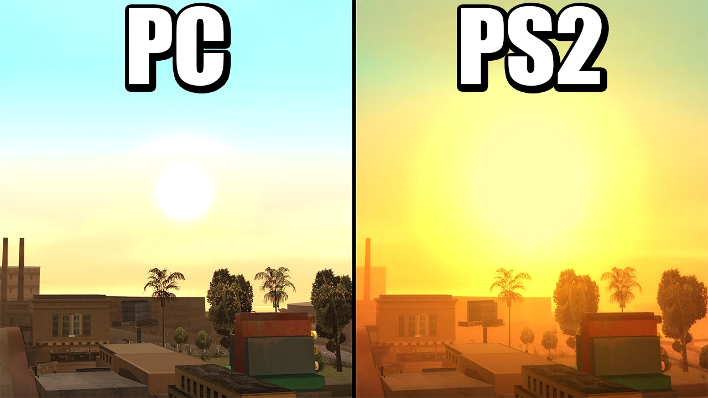
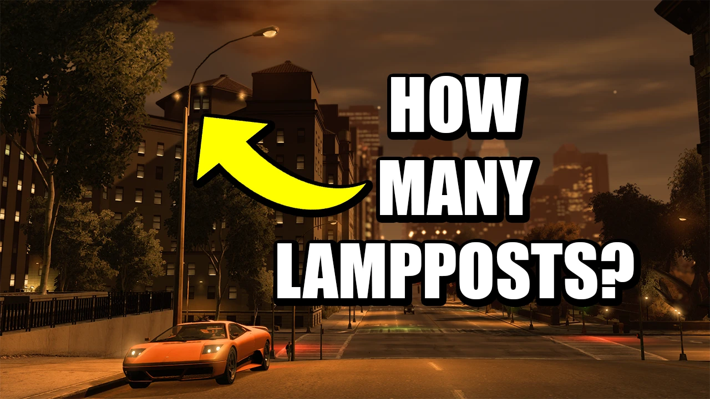
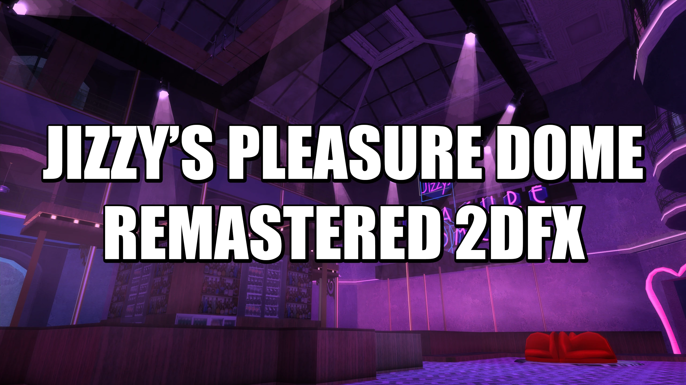
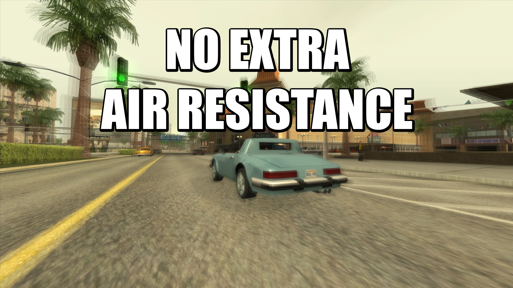
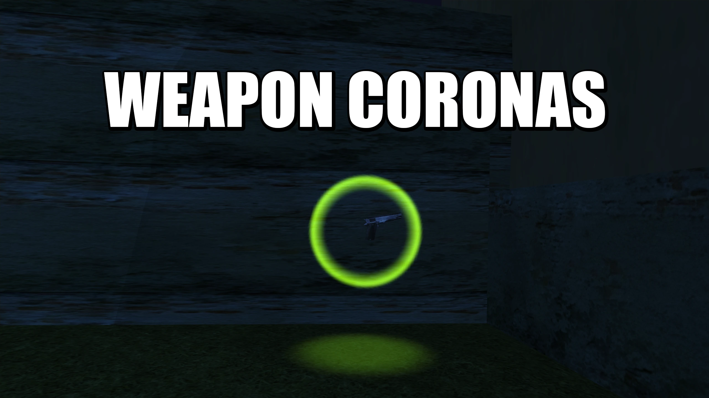
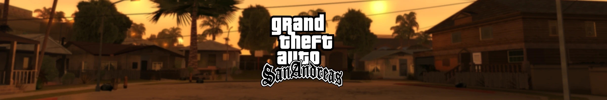
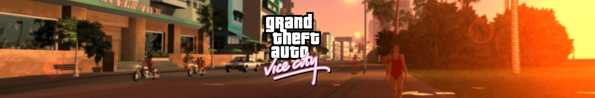
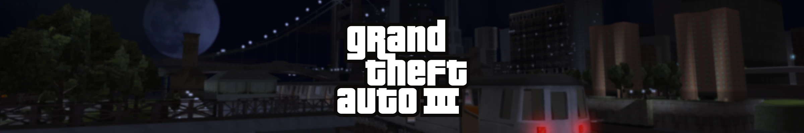

<link rel="preload" as="image" href="../assets/herolight.webp">

  

    <h1> Welcome to the TJGM website! </h1>

    <!-- Subheading added -->
    
The best place for technical GTA guides, news, videos and more.

    

      <!-- Twitch Video -->
      

        <iframe
          src="https://player.twitch.tv/?channel=tjgm&parent=localhost&parent=127.0.0.1"
          allowfullscreen>
        </iframe>
      

      <!-- Buttons -->
      

        <a href="#news" class="md-button hero-btn hero-btn-dark">
          📰 News
        </a>

        <a href="#latest-videos" class="md-button hero-btn hero-btn-dark">
          🎥 Videos
        </a>

        <a href="#mods" class="md-button hero-btn hero-btn-dark">
          🔧 Mods
        </a>

        <a href="#guides" class="md-button hero-btn hero-btn-dark">
          📚 Guides
        </a>

        <a href="https://www.patreon.com/TJGM" class="md-button hero-btn hero-btn-accent" target="_blank" rel="noopener noreferrer">
          ⭐ Patreon
        </a>

      

    

  

 <!-- Push content below hero -->

<!-- News Section Header with View More -->

  <h2>News</h2>
  <a href="news/" class="view-more-link" target="_blank">View more...</a>

  <!-- Latest Blog Post 1 -->
  

    <a href="/news/a-new-modding-site-for-gta-games-is-now-live/" target="_blank">
      

        
      

      
A new modding site for GTA games is now live!

    </a>
    

      March 1, 2026
    

  

  <!-- Latest Blog Post 2 -->
  

    <a href="/news/gta-iv-now-has-native-hdr-support/" target="_blank">
      

        
      

      
GTA IV Now Has Native HDR Support

    </a>
    

      November 15, 2025
    

  

  <!-- Latest Blog Post 3 -->
  

    <a href="/news/bully-multiplayer-mod-taken-down-by-rockstar-games/" target="_blank">
      

        
      

      
Bully Multiplayer Mod Taken Down by Rockstar Games

    </a>
    

      April 15, 2024
    

  

<!-- Latest Videos Section Header with View More -->

  <h2>Videos</h2>
  <a href="https://www.youtube.com/@tjgm" class="view-more-link" target="_blank" rel="noopener noreferrer">View more...</a>

  

    <a href="https://www.youtube.com/watch?v=AvkuZTezDas" target="_blank" rel="noopener noreferrer">
      

        
      

      
Everything WRONG With The Sun In San Andreas

    </a>
  

  

    <a href="https://www.youtube.com/watch?v=rqj0T6I2D1s" target="_blank" rel="noopener noreferrer">
      

        
      

      
How Many Lampposts are in Liberty City?

    </a>
  

  

    <a href="https://www.youtube.com/watch?v=XTuOortPoY4" target="_blank" rel="noopener noreferrer">
      

        
      

      
How Modders Fixed GTA IV

    </a>
  

<!-- =========================
     MODS SECTION
     ========================= -->

  <h2>Mods</h2>

  <!-- Mod 1 -->
  

    <a href="/mods/Improved-2DFX/" target="_blank">
      

        
      

      
Improved 2DFX

    </a>
    

      
III

      
VC

      
SA

    

  

  <!-- Mod 2 -->
  

    <a href="/mods/Jizzy's-Pleasure-Dome-Remastered-2DFX/" target="_blank">
      

        
      

      
Jizzy's Pleasure Dome Remastered 2DFX

    </a>
    

      
SA

    

  

  <!-- Mod 3 -->
  

    <a href="/mods/No-Extra-Air-Resistance/" target="_blank">
      

        
      

      
No Extra Air Resistance

    </a>
    

      
SA

    

  

  <!-- Mod 4 -->
  

    <a href="/mods/Orange-Bulb-Lampposts/" target="_blank">
      

        
      

      
Orange Bulb Lampposts

    </a>
    

      
SA

    

  

  <!-- Mod 5 -->
  

    <a href="/mods/Weapon-Coronas/" target="_blank">
      

        
      

      
Weapon Coronas

    </a>
    

      
SA

    

  

  <h2>Guides</h2>

Modding Guides:

- [Fixing GTA IV with 4 Mods](guides/gtaiv/Fixing-GTA-IV-with-4-Mods/index.md)
- [Fusion Overloader Tutorial](guides/gtaiv/Fusion-Overloader-Tutorial/index.md)
- [How to Install Console Visuals](guides/gtaiv/Fusion-Overloader-Tutorial/index.md)

Resources:

- [How to Fix GTA IV's Taxi Bug](guides/gtaiv/Fusion-Overloader-Tutorial/index.md)

- [How to Downgrade EVERY Version Grand Theft Auto: San Andreas](guides/gtasa/How-to-Downgrade-EVERY-Version-of-GTA-San-Andreas/index.md)
- [Ultimate Modding Guide for Grand Theft Auto: San Andreas](guides/gtasa/Ultimate-Modding-Guide-for-GTA-San-Andreas/chapter1.md)

- [How to Downgrade EVERY Version of Grand Theft Auto: Vice City](guides/gtavc/How-to-Downgrade-EVERY-Version-of-GTA-Vice-City/index.md)
- [Restoring the Vice City Radio without Downgrading](guides/gtavc/Restoring-the-Vice-City-Radio-without-Downgrading/index.md)

- [How to Downgrade EVERY Version of Grand Theft Auto: III](guides/gtaiii/How-to-Downgrade-EVERY-Version-of-GTA-III/index.md)

  <h2>About</h2>

  <!-- Photo -->
  

    <!-- Replace src with your photo -->
    
  

  <!-- Text -->
  

    <h3>James / TJGM</h3>

    

    Hi! I'm James, otherwise known as TJGM. I run the 
    <a href="https://www.youtube.com/@TJGM" target="_blank" rel="noopener noreferrer">
        TJGM YouTube channel
    </a>
    and I also run this website.

    

    

        The main goal of this site is to act as an archive for my work, increase accessibility to my guides and also use it to promote good work from the modding community. I try to support as much open-source and free work as possible, as modding thrives on collaboration, sharing knowledge and helping each other when we can.
    

    

        If you've found any of my work helpful, you can thank my amazing girlfriend Kate for giving me the confidence to start all of this. Without her, I'd have never started my YouTube channel and this site wouldn't exist.
    

    

        "I think you sound really good!"... that's what she said 
        <a href="https://www.youtube.com/watch?v=JkRSH0TlMXE" target="_blank" rel="noopener noreferrer">
        to this</a>.
    

  

