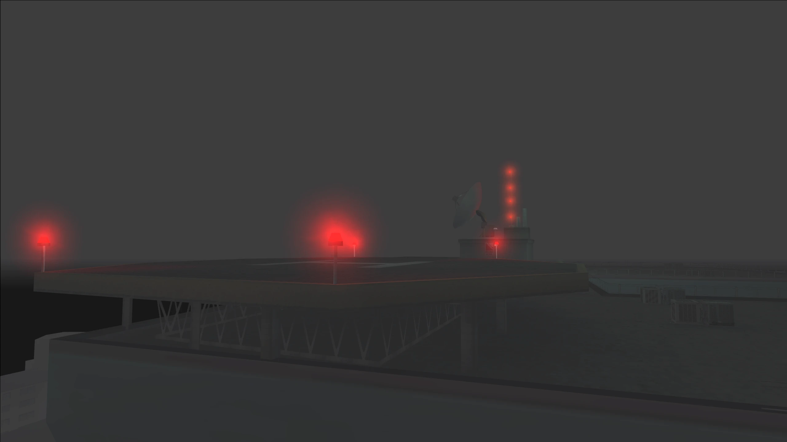
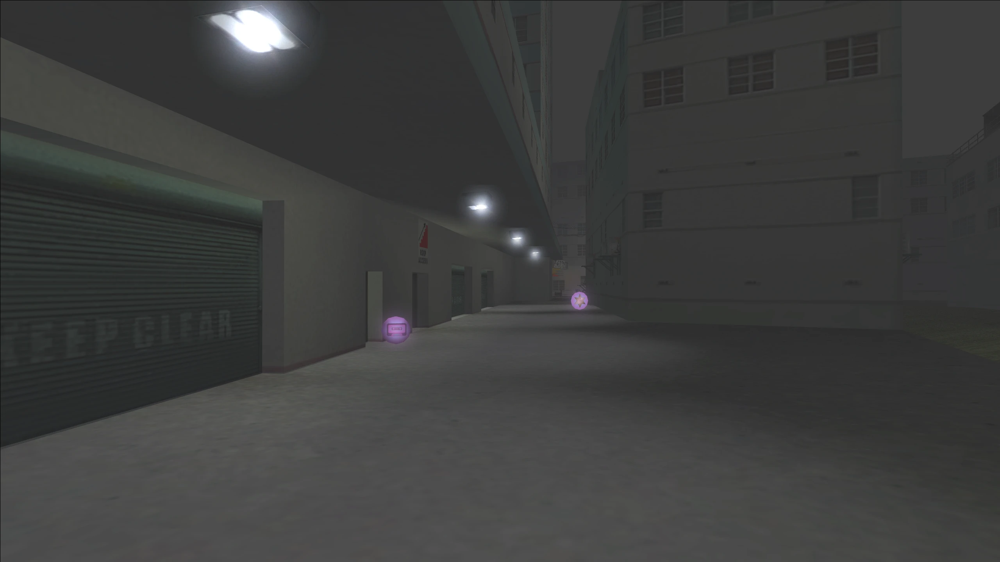
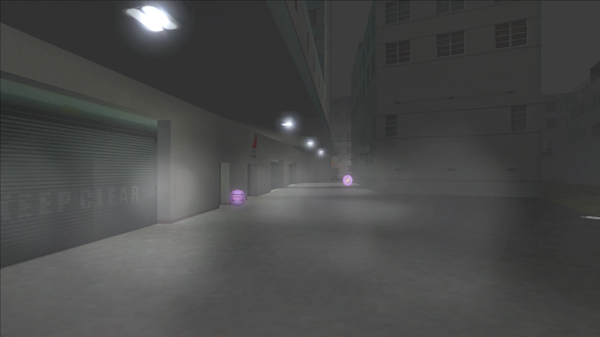
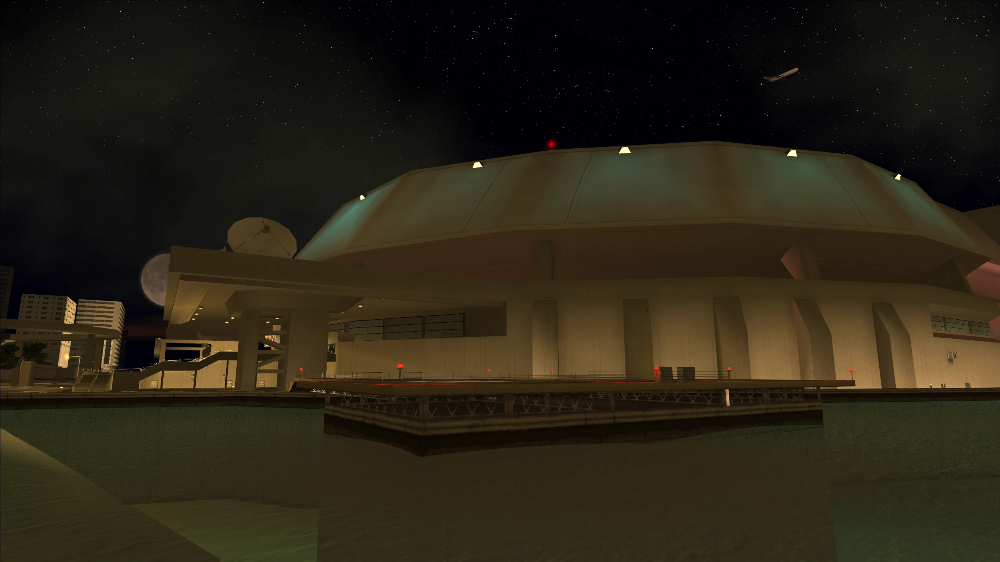
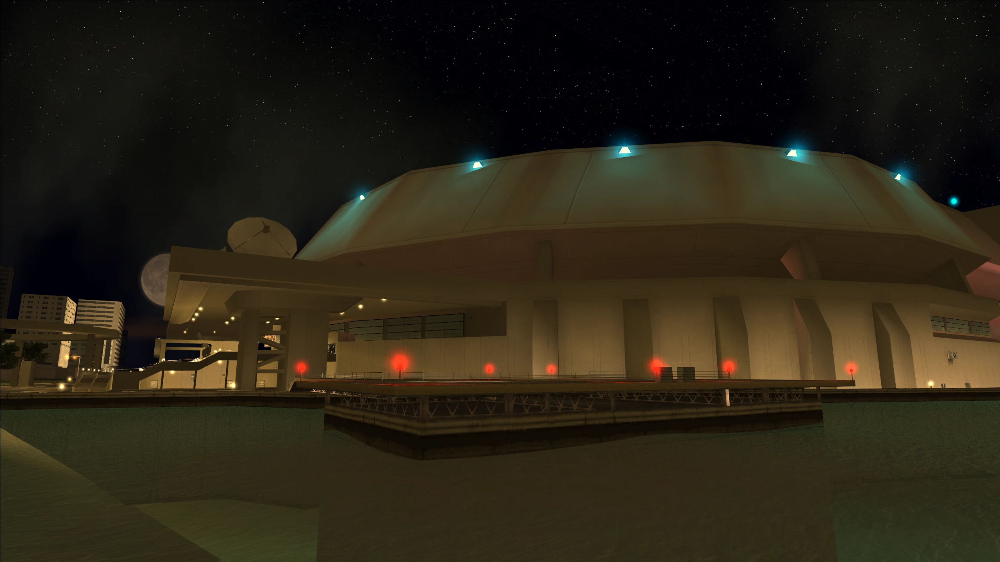
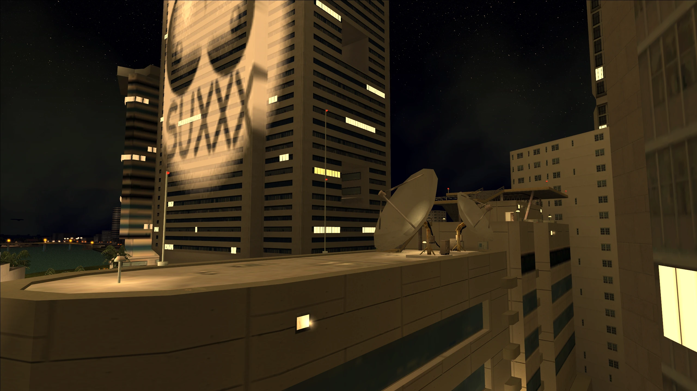
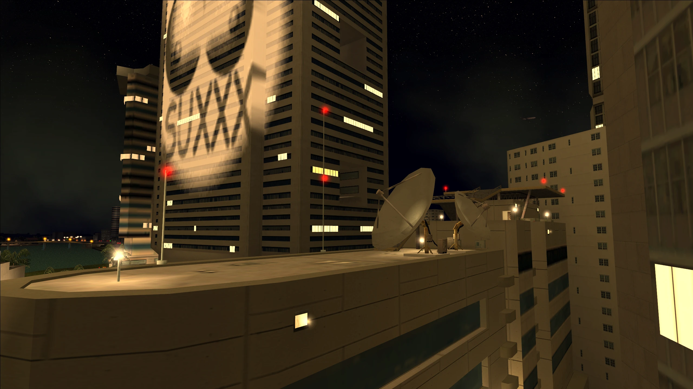
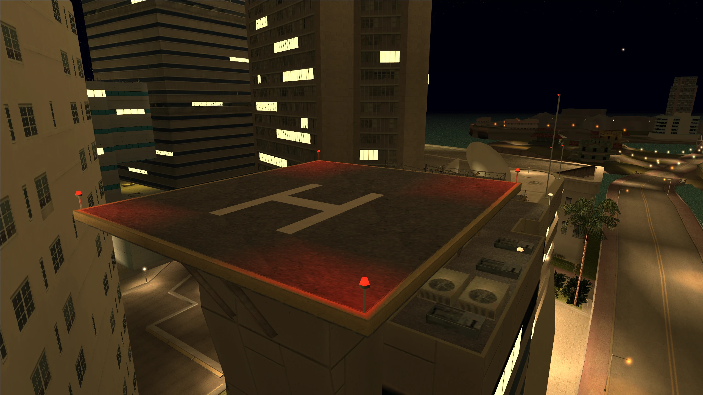

# Improved 2DFX

## What is it?

Improved 2DFX adds new lights to Vice City and San Andreas where they would be expected and it also enhances other lights and 2DFX seen in GTA III, Vice City and San Andreas.

## Changelog

??? note "Click to view the full changelog"
    !!! info
        Exact files edited for each change will be in brackets () at the end of the change when possible.

    **v1.0 (Originally "Improved Hyman Memorial 2DFX", Vice City only)**
    
    - Initial release.
    - Added coronas to the Hyman Memorial Stadium.

    **v2.0**

    - Changed mod name to "Improved 2DFX"
    - Mod is now available for GTA III and San Andreas.

    **Vice City Changes**

    - Added coronas to light models on the Vice City News rooftop.
    - Enabled "dust" effects and corona reflections to the coronas at the Downtown safehouse.
    - Changed red lights on the Downtown safehouse roof to pure red.
    - Added coronas to the blimp at night time instead of the poor light models/textures used before.
    - Changed the downtown skyscraper light/window models so they appear at 19:00 instead 18:00 and disappear at 07:00 instead of 08:00. This aligns better with other game lights and Project 2DFX.
    - Added coronas to the light models on top of the downtown skyscrapers. 
    - Updated the downtown spotlight model so it disappears at 07:00 instead of 05:00. This aligns better with other game lights and Project 2DFX. Also changed the draw distance of the model from 1000 to 3000 so it's visible all over the map.
    - Updated the coronas at the downtown spotlight so it's bigger (Size is now 150 instead of 90) and the draw distance of the light has been changed from 2000 to 3000 so it's visible all over the map.

## Download and Installation

- Step 1: Download the mod below for the game you want from your preferred source.

    - GTA III: [GitHub](https://www.gtagarage.com/mods/show.php?id=25639), [Mega](https://www.gtagarage.com/mods/show.php?id=25639), [GTAInside](https://www.gtagarage.com/mods/show.php?id=25639) or [Nexus](https://www.gtagarage.com/mods/show.php?id=25639).

    - GTA VC: [GitHub](https://www.gtagarage.com/mods/show.php?id=25639), [Mega](https://www.gtagarage.com/mods/show.php?id=25639), [GTAInside](https://www.gtagarage.com/mods/show.php?id=25639) or [Nexus](https://www.gtagarage.com/mods/show.php?id=25639).

    - GTA SA: [GitHub](https://www.gtagarage.com/mods/show.php?id=25639), [Mega](https://www.gtagarage.com/mods/show.php?id=25639), [GTAInside](https://www.gtagarage.com/mods/show.php?id=25639) or [Nexus](https://www.gtagarage.com/mods/show.php?id=25639).

- Step 2: Open the mod archive you downloaded and move the **"Improved 2DFX v2.0"** folder from the archive into your **"modloader"** folder.

[Click here for older mod versions (if available)](https://www.gtagarage.com/mods/show.php?id=25639)

## Screenshots

  <!-- Bottom image -->
  
  
  <!-- Top image -->
  

    
  

  
  <!-- Vertical line -->
  

  <!-- Circular handle -->
  

  <!-- Captions -->
  
Before

  
After

  <!-- Bottom image -->
  
  
  <!-- Top image -->
  

    
  

  
  <!-- Vertical line -->
  

  <!-- Circular handle -->
  

  <!-- Captions -->
  
Before

  
After

  <!-- Bottom image -->
  
  
  <!-- Top image -->
  

    
  

  
  <!-- Vertical line -->
  

  <!-- Circular handle -->
  

  <!-- Captions -->
  
Before

  
After

  <!-- Bottom image -->
  
  
  <!-- Top image -->
  

    
  

  
  <!-- Vertical line -->
  

  <!-- Circular handle -->
  

  <!-- Captions -->
  
Before

  
After

  <!-- Bottom image -->
  
  
  <!-- Top image -->
  

    
  

  
  <!-- Vertical line -->
  

  <!-- Circular handle -->
  

  <!-- Captions -->
  
Before

  
After

  <!-- Bottom image -->
  
  
  <!-- Top image -->
  

    
  

  
  <!-- Vertical line -->
  

  <!-- Circular handle -->
  

  <!-- Captions -->
  
Before

  
After

  <!-- Bottom image -->
  
  
  <!-- Top image -->
  

    
  

  
  <!-- Vertical line -->
  

  <!-- Circular handle -->
  

  <!-- Captions -->
  
Before

  
After

## Known Issues

- Game crashes when quitting. This seems to be caused by too many 2DFX entries in a single .ide file.

## Credits

- TJGM

All my mods are free to use, share and reuse in other mods. All I ask is that you give credit, thanks!

  <h3>Enjoy my work?</h3>
  
If you've ever found my work helpful or useful in any way, please consider supporting me on Patreon, it's very much appreciated! ❤️

  <a
    class="md-button"
    href="https://patreon.com/tjgm"
    target="_blank"
    rel="noopener"
    style="background:#F96854; color:white; border:none; border-radius:8px; padding:.6em 1.2em; margin-top:0.5rem;"
  >
    ⭐ Support on Patreon
  </a>

