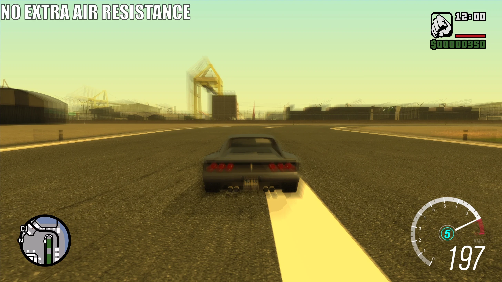
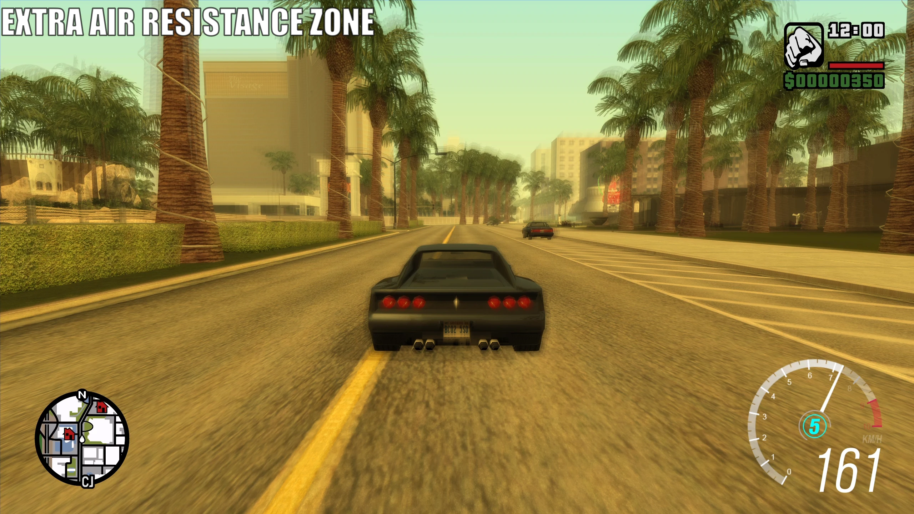
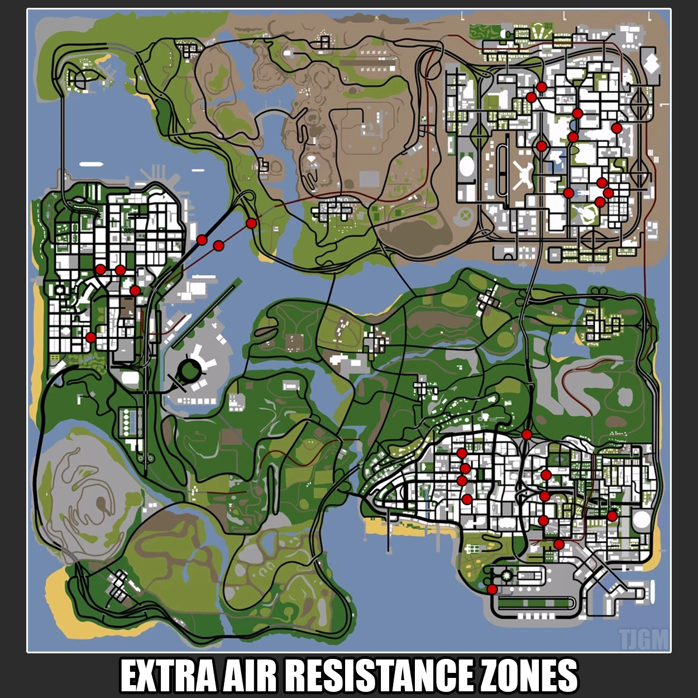

# No Extra Air Resistance

## What is it?

In order to optimize the game, Rockstar slows the player down in specific areas of the map using zones which have "extra air resistance". This is done through "cull.ipl", which contains all of the cull zones on the map, one of the possible flags for a cull zone is "ExtraAirResistance".

For example, the Cheetah has a max speed of 197KMPH, as seen in the screenshot below.

But when driving in a cull zone with extra air resistance, the Cheetah can only reach a max speed of 161KMPH.

With this mod, the extra air resistance flag is disabled, as this optimisation is no longer necessary on modern hardware. This should be compatible with basically every mod.

And if you're wondering, I've made a map with all of the extra air resistance locations in San Andreas, if you use this mod however, this will obviously be obsolete.

I've also made a YouTube video covering this topic if you're interested in learning more.

<iframe width="560" height="315" src="https://www.youtube.com/embed/vp9WlW9reG4?si=gSuHT4TMXo8s7CM6" title="YouTube video player" frameborder="0" allow="accelerometer; autoplay; clipboard-write; encrypted-media; gyroscope; picture-in-picture; web-share" referrerpolicy="strict-origin-when-cross-origin" allowfullscreen></iframe>

## Changelog

??? note "Click to view the full changelog"
    !!! info
        Exact files edited for each change will be in brackets () at the end of the change when possible.

    **v1.0**

    - Initial release.
    - Removed all cullzones that contain the "ExtraAirResistance" flag. (cull.ipl)

    **v2.0**

    - The mod has been updated to be an ASI plugin made by iFarbod, which disables the extra air resistance flag in general.
      
        My solution was to just remove the flag from the zones in "cull.ipl", but this could potentially create incompatibility with other mods if they also altered "cull.ipl" (rare, but still possible), so his solution is much cleaner and better for compatibility.

## Download and Installation

- Step 1: Download the mod from your preferred source.

    - GTA SA: [GitHub](https://www.gtagarage.com/mods/show.php?id=25639), [Mega](https://www.gtagarage.com/mods/show.php?id=25639), [GTAInside](https://www.gtagarage.com/mods/show.php?id=25639) or [Nexus](https://www.gtagarage.com/mods/show.php?id=25639).

- Step 2: Open the mod archive you downloaded and move the **"No Extra Air Resistance 2.0"** folder from the archive into your **"modloader"** folder.

[Click here for older mod versions (if available)](https://www.gtagarage.com/mods/show.php?id=25639)

## Credits

- iFarbod
- TJGM

All my mods are free to use, share and reuse in other mods. All I ask is that you give credit, thanks!

  <h3>Enjoy my work?</h3>
  
If you've ever found my work helpful or useful in any way, please consider supporting me on Patreon, it's very much appreciated! ❤️

  <a
    class="md-button"
    href="https://patreon.com/tjgm"
    target="_blank"
    rel="noopener"
    style="background:#F96854; color:white; border:none; border-radius:8px; padding:.6em 1.2em; margin-top:0.5rem;"
  >
    ⭐ Support on Patreon
  </a>
