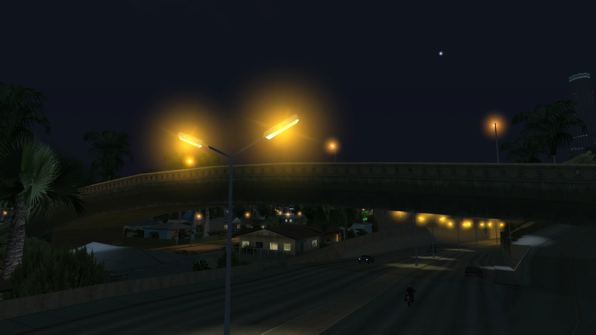
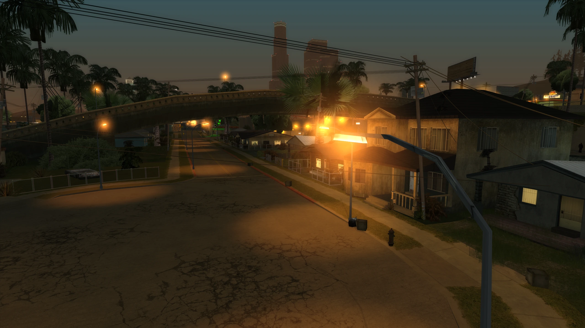
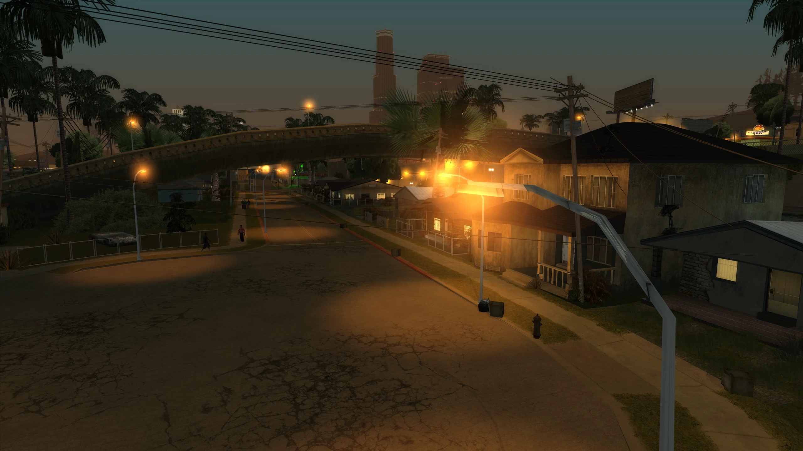

# Orange Bulb Lampposts

## What is it?

The bulbs on lampposts are white instead of orange at night, this fixes that.

## Changelog

??? note "Click to view the full changelog"

    **v1.0**

    - Initial release.
    - Changed night vertex colours on several lamppost models so that the bulb part of the model is orange at night when the corona is active instead of white.

## Download and Installation

- Step 1: Download the mod from your preferred source.

    - GTA SA: [GitHub](https://www.gtagarage.com/mods/show.php?id=25639), [Mega](https://www.gtagarage.com/mods/show.php?id=25639), [GTAInside](https://www.gtagarage.com/mods/show.php?id=25639) or [Nexus](https://www.gtagarage.com/mods/show.php?id=25639).

- Step 2: Open the mod archive you downloaded and move the **"Weapon Coronas v1.1"** folder from the archive into your **"modloader"** folder.

[Click here for older mod versions (if available)](https://www.gtagarage.com/mods/show.php?id=25639)

## Screenshots

  <!-- Bottom image -->
  
  
  <!-- Top image -->
  

    
  

  
  <!-- Vertical line -->
  

  <!-- Circular handle -->
  

  <!-- Captions -->
  
Before

  
After

  <!-- Bottom image -->
  
  
  <!-- Top image -->
  

    
  

  
  <!-- Vertical line -->
  

  <!-- Circular handle -->
  

  <!-- Captions -->
  
Before

  
After

## Known Issues

- Lamppost models appear a bit brighter than the original models. You can see this in the comparisons above.

## Credits

- TJGM

All my mods are free to use, share and reuse in other mods. All I ask is that you give credit, thanks!

  <h3>Enjoy my work?</h3>
  
If you've ever found my work helpful or useful in any way, please consider supporting me on Patreon, it's very much appreciated! ❤️

  <a
    class="md-button"
    href="https://patreon.com/tjgm"
    target="_blank"
    rel="noopener"
    style="background:#F96854; color:white; border:none; border-radius:8px; padding:.6em 1.2em; margin-top:0.5rem;"
  >
    ⭐ Support on Patreon
  </a>
