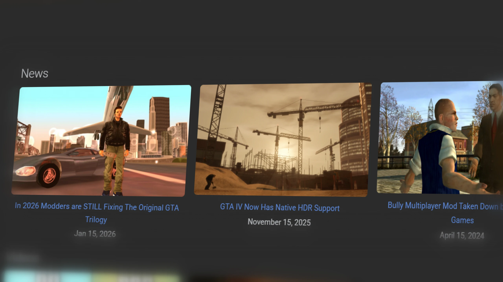

*News, guides, mods and more. What else can a GTA fan ask for?*

<!-- more -->

Welcome to the first official news post on the TJGM website! The best website for all TJGM content as well as GTA modding news and resources.

For too long modding news, resources and just general information has been hard to find due to the rise of private Discord servers and just general gatekeeping.

I'm guilty of it myself. Most of my GTA modding guides are YouTube videos. These can be hard to find due to the YouTube algorithim, difficult to archive and just less accessible both in general and to users with disabilities.

So the aim of this website is to reduce that as much as I can. Let's break it down.

## The News

A lot of new mods, modding breakthroughs, mod updates, guides and whatever else are now posted on Discord servers... and that's it. Public forums like GTAForums aren't nearly as popular anymore for mod discussion, which means a lot of information and content is very difficult to find in 2026.

One major problem with Discord is that even if the server is open to the public, the content on the servers isn't indexed on search engines. This means searching for specific content isn't possible unless you're already in a Discord server containing that content. Even if you're in multiple GTA modding Discord servers, you'd have to search all of them for the content you want. It's messy and not easily accessible.

Another problem is that in general, it's also very difficult for users to find Discord servers unless they're following specific people or groups elsewhere who have public invites to their Discord server. While you can find public servers through search engines, it's hard to know exactly what content they'll contain.

And lastly, Discord servers cannot be archived easily. Discord servers can be deleted, content on them can be removed and specific sections of a Discord server can be there one week and gone another. Once it's gone, it's typically gone forever. This isn't the case with websites like GTAForums, Wikis and other public modding sites. Modding content can be deleted by site owners or moderators, sites could be live one day and gone another day, but because it's a public website, people can archive these things much easier and in a more accessible way.

So my plan with this website is to share modding news that would usually be tucked away in Discord or other private places and get them into a public place. Where things can be easily searched and archived for users now and in the future.

I can't do this on my own however. I'm in multiple GTA Modding Discord servers and while I check them often enough, I can't keep track of everything.

So on my Discord server (ironic, I know), there's now a #tips channel where users can send me anything new that they've found that might be newsworthy for the GTA community. While I'd prfer not to use Discord for this, it's probably the easiest place for such a task and the place where most users will share what they've found.

BUTTON LINK HERE

## The Guides

I'm mostly known for my modding guides and technical YouTube videos about various aspects of GTA. I started YouTube back in 2020, originally making HITMAN speedrun videos and this eventually transitioned into making GTA modding videos.

The main reason I wanted to do this to begin with was that I felt like I had knowledge that wasn't really shared anywhere else. Not that this knowledge was unique to me, it just wasn't available anywhere in an easily accessible place for the average person.

I frequently saw poor modding guides on YouTube and forums. They'd often recommend outdated broken tools, shared outdated information, missed key points or context for certain tasks and in general just weren't easy to follow or understand for the average person.

I thought I could change this and I feel like I have. One of the most common comments I get on YouTube other than people making jokes about my accent (I find these funny too), is that my guides are some of the best, everything a user needs to know is covered and everything was easy to understand.

Yes it can be a bit slower and videos can be a bit longer, but by the end, users come out with more knowledge and less problems than they did before and that knowledge is very accurate and genunienly useful.

I always try to make the guides as accessible as I can. I make sure each video has subtitles, I try to make sure all important text is readable and not blocked by subtitles if a user is using them and I talk slower during guides so people with poor English can understand me better (especially with the accent). Again, accessibility to all is my main focus.

And this website feels like the next step towards that.

Instead of my guides being exclusively videos, I want them to be much more accessibile which text form provides. Guides can be archived better, specific content within a guide can be easier to search for AND guides can be updated easier compared to videos, which often become outdated over time and I have to add additional steps or information to the description/pinned comment later on.

I'm currently in the middle of converting my guides to text form for this site. You can find them all on the homepage, some aren't available yet, but overtime they will be and new ones will also be added.

Of course this doesn't mean I won't make video guides anymore. I know a lot of people find videos easier to follow and having visuals to go along with steps can really help. Most of my guides will have a video equivalent on my YouTube channel and the video related to each guide on this website will be linked on the guide page as well for users who prefer them.

-----

  <h3>Found this useful?</h3>
  
Gain benefits such as shout-outs at the end of videos, early access to TJGM videos, early access to TJGM mods, VIP Discord access and much more by supporting me and my work on Patreon, it's very much appreciated! ❤️

  <a
    class="md-button"
    href="https://patreon.com/tjgm"
    target="_blank"
    rel="noopener"
    style="background:#F96854; color:white; border:none; border-radius:8px; padding:.6em 1.2em; margin-top:0.5rem;"
  >
    ⭐ Support on Patreon
  </a>

